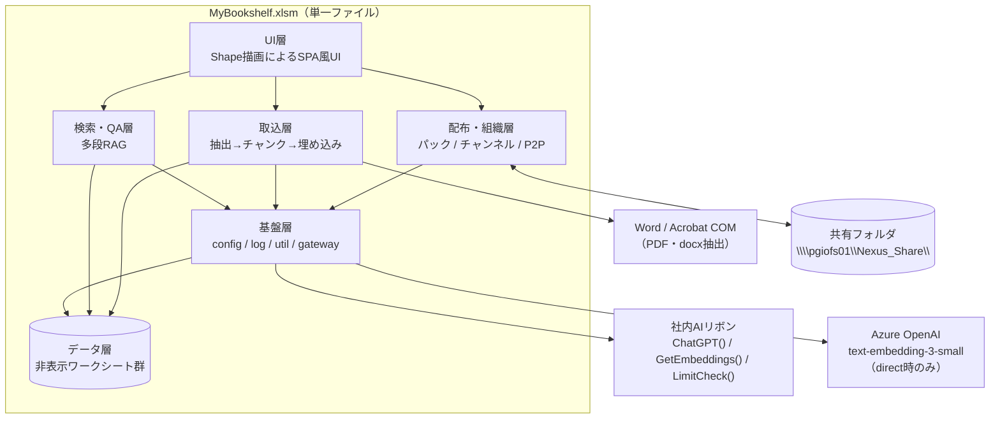
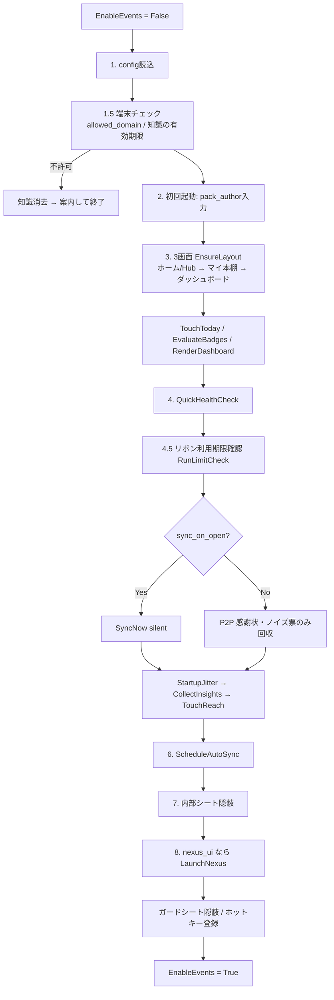
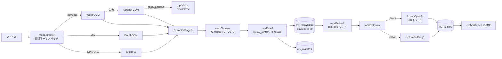
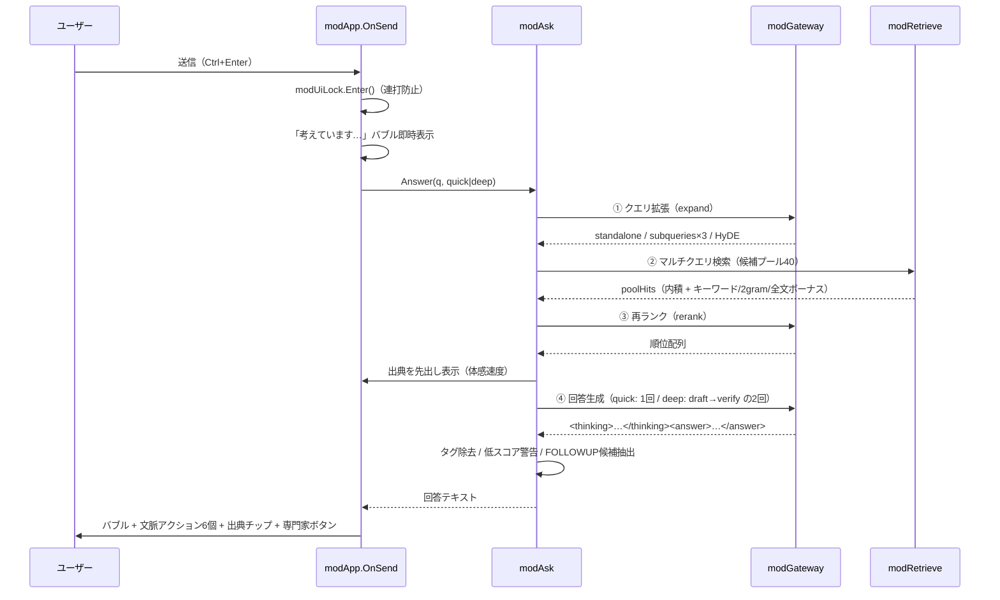
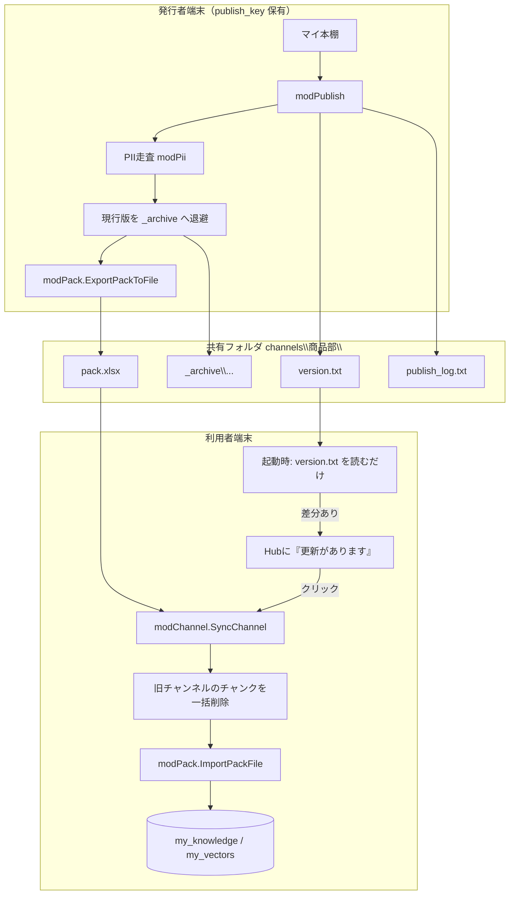

# MyBookshelf（Nexus Agent）ツール解説書

**Excel 1ファイルで動く、社内資料専用の AI 質問応答＆ナレッジ配信ツール — 仕組み・運用・利用ガイド**

> 対象ファイル: `MyBookshelf.xlsm`（約 1.42 MB） / アプリ名: **Nexus Agent** / バージョン `0.1.0` / ビルド `20260727-011626Z+8ad78dd`
> 本書は、ファイル内部のプログラム（VBA ソース 65 本・約 26,400 行）と設定データを直接読み解いて作成した解説書です。原則としてプログラムの記述を根拠にしており、筆者の推測・提案には都度その旨を明記しています。

## 本書の読み方

全部を読む必要はありません。立場に合わせて必要な章から読んでください。

| あなたの立場・知りたいこと | 読む章 |
|---|---|
| このツールで何ができるのか、ざっくり知りたい | §1 → §2 → 各章冒頭の「💡ポイント」だけ拾い読み |
| 利用者として使う上でのルール・注意点 | §12.7（利用ルール）→ §6.5（ダッシュボード） |
| 導入・配布の担当になった | §12 全体（チェックリストとして使える）→ §11（既知の課題） |
| 部門ナレッジの発行担当になった | §6.3（配信の流れ）→ §12.6（運用ルール） |
| AI の回答がどう作られるのか知りたい | §6.2（品質の仕組み）→ §6.2.8（AI への指示文の全文） |
| 開発を引き継ぐ・改修する | 全章。特に §4（構造）→ §6（処理の流れ）→ §11（既知の課題） |

各章の冒頭に「💡 **この章のポイント**」として平易な要約を置いています。技術的な詳細は読み飛ばしても、ポイントだけで全体像がつながる構成です。

## 用語ミニ辞典

本書に繰り返し出てくる用語です。ここだけ押さえれば以降が読みやすくなります。

| 用語 | 意味 |
|---|---|
| **マクロ / VBA** | Excel に内蔵されたプログラミング機能。このツールの本体はすべて VBA で書かれている |
| **RAG（検索拡張生成）** | AI に「手元の資料を検索し、見つかった内容**だけ**を根拠に答えさせる」方式。AI が記憶や想像で答えてしまう事故（ハルシネーション）を防ぐための標準的な手法 |
| **チャンク** | 資料を検索しやすい大きさ（数百字＝概ね条文1つ分）に切った断片。このツールの検索・回答はすべてチャンク単位で動く |
| **埋め込み / ベクトル化** | 文章の「意味」を数百個の数値の並び（ベクトル）に変換すること。数値同士を比べると「意味が近いか」を機械的に計算できる |
| **ベクトルストア（ベクトルDB）** | ベクトルの保管場所。専用製品を使うのが一般的だが、このツールでは Excel の隠しシートがその役割を担う |
| **LLM** | ChatGPT に代表される文章生成 AI 本体（大規模言語モデル） |
| **プロンプト** | AI へ渡す指示文。回答の品質はここでほぼ決まる（このツールが使う指示文の全文を §6.2.8 に掲載） |
| **AI リボン** | 社内標準の Excel 用 AI アドイン。このツールは自前の AI を持たず、すべてこのアドイン経由で AI を呼び出す |
| **出典 / グラウンディング** | 回答の根拠となった資料名とページ。このツールは「出典を付けられない主張は書かない」ことを AI に強制している |
| **正典（パック）** | 部門が公式に配信するナレッジ一式。マクロ無しの Excel ファイル（pack.xlsx）として共有フォルダに置かれる |
| **チャンネル** | 部門ごとの配信単位。利用者は YouTube のチャンネル登録のように部門を選んで受信する |
| **共有フォルダ（UNC パス）** | `\\サーバ名\フォルダ名` 形式で社内の全員がアクセスするファイル置き場。このツールの「社員間のやり取り」はすべてここを経由する |
| **config** | ツールの設定一覧を書いた隠しシート。プログラムを触らずにセルの値を変えるだけで動作を調整できる |
| **モジュール** | プログラムの部品。このツールは約 80 個のモジュールでできている |

---

## 1. このツールは何か

💡 **一言でいうと**: 「Excel ファイル 1 個で動く、社内資料専用の AI 質問応答ツール」＋「部門ナレッジの配信基盤」。

図書館にたとえると次の3点セットです。

- **マイ本棚** = 自分専用の本棚。PDF・Word・Excel の資料を放り込んでおく
- **AI 司書** = 質問すると本棚から該当ページを探し出し、「この資料の 12 ページにこう書いてあります」と**出典付き**で答える
- **部門チャンネル** = 出版部。商品部などの部門が「公式資料セット（正典）」を発行すると、購読している全員の本棚へ自動で届く

インストール不要・サーバ不要で、**ファイルを渡すだけで配布が完結する**のが最大の特徴です（その代償として生じる制約は §11・§12 で詳述します）。

技術的に正確に言うと: Excel マクロブック 1 個で完結する**社内向け RAG チャットボット + ナレッジ配信基盤**。資料をチャンク化・ベクトル化してブック内に保持し、出典付きで質問応答する。部門が「正典（canonical pack）」を共有フォルダへ発行し、各端末が購読・同期するチャンネル配信モデルを持つ。サーバもデータベースも使わず、**すべての永続化は非表示ワークシート**、**すべての端末間通信は共有フォルダ上のファイル**で行う。

---

## 2. 全体構成

> 💡 **この章のポイント** — ツールの中身は「画面」「AI との対話」「資料の取込」「部門への配信」「共通の土台」の5つの部品群でできている。データベースの代わりに**隠しシート**、社内サーバの代わりに**共有フォルダ**を使う、というのがこの設計の骨格。



### アーキテクチャ上の3つの意思決定

| # | 決定 | 理由（コード内コメントより） |
|---|---|---|
| 1 | **DB を持たず非表示シートに全保存** | 配布が「ファイル1個を渡す」で完結する。インストール不要 |
| 2 | **タブではなく Shape（図形）で画面を構成** | Excel 感を消した SPA 風 UI。タブ表示が不安定な環境でも巡回できる（`modUI` / `modHub`） |
| 3 | **端末間通信をファイル共有フォルダで代替** | 1人1ファイル書き込み（上書き）に限定することで書込競合をゼロにする（`modP2P` / `modBoard` / `modInsight`） |

---

## 3. 実行基盤と配布形態

> 💡 **この章のポイント** — このファイルは開くたびに、内部へ文字として保存されたプログラムを自分で組み立て直してから起動する「自己インストール方式」。このため通常のマクロ有効化に加えて、特別なセキュリティ設定が 1 つ必要になる（§12.2 #4）。起動処理は途中で失敗しても全体が止まらないよう、段階ごとに保護されている。

### 3.1 自己インストール型ブック

`ThisWorkbook.Workbook_Open` は **`Install`** を呼ぶだけ。`Install` は非表示シート **`vba_src`**（`veryHidden`）に格納された全モジュールのソースコードを読み、`VBProject.VBComponents` へ **実行時に注入**する。

```
Workbook_Open
  └─ Install()                     ' vba_src シート → VBComponents へ全モジュール注入
       ├─ 既存コンポーネントを Remove → Add(1) → CodeModule.AddFromString
       ├─ modBoot.RunFirstRunPromptEarly   ' 初回の名前入力
       ├─ ThisWorkbook.Save
       └─ Application.OnTime (+1秒) → modBoot.Boot   ' 初期化中の1004回避のため遅延実行
                                     ↓ 失敗時は Application.Run で同期実行にフォールバック
```

- 「VBA プロジェクトへのアクセスを信頼する」設定が必須。未設定時は `Trust:` ラベルで警告して終了。
- 実行時の本命エントリは **`modBoot.Auto_Open` / `Auto_Close`**（インストーラが `ThisWorkbook` を占有するための二重化設計）。

### 3.2 起動シーケンス（`modBoot.Boot`）

各段階に `bootStage` 名を持ち、失敗時は `E0801` として「どの段階で落ちたか」を err_log とダイアログの両方に出す。3画面の描画は**個別に** `On Error Resume Next` で保護され、1画面の失敗がアプリ全体の起動を止めない。



- **ガードシート** `はじめにお読みください` は先頭・可視で配置され、マクロ無効で開かれた場合はそれがそのまま見える（壊れた UI を見せない）。起動成功時にのみ隠される。
- **起動ジッタ**: `startup_jitter_ms`（既定 3000ms）でランダム待機。始業時に全社員が同時に共有フォルダを叩いてファイルサーバが詰まるのを防ぐ。
- **重い処理は起動時に一切しない**。チャンネルは `version.txt` を読むだけで、実際の取り込み（埋め込み API を消費する）は必ずユーザーのクリックを待つ。

---

## 4. レイヤと依存規則

> 💡 **この章のポイント** — プログラムは約 80 個の部品（モジュール）に分かれ、「上位の部品は下位の部品しか呼ばない」「AI の呼び出し窓口は 1 箇所だけ」といった厳格な内部ルールで統制されている。主に開発を引き継ぐ人向けの章で、部品一覧表は改修時の辞書として使える。

コード内で `MASTER_SPEC` として参照されている設計契約が、全モジュールのヘッダーコメントに一貫して現れる。

| 規則 | 内容 | 実装上の担保 |
|---|---|---|
| **R1 レイヤリング** | 参照は常に下向き（UI → QA → 取込 → 基盤） | 例: `modPeek` は `modAsk.LastHit*` の読み取り専用アクセサ経由でのみ検索結果に触る |
| **R2 opt層の隔離** | コアから `opt*` モジュールを直接参照しない | 全て `modFeatures.InvokeFeature` が `Application.Run` で遅延バインド。撤去は「ビルドリストから1行削除 + config フラグ FALSE」で完結 |
| **R3 外部AIの単一窓口** | `ChatGPT()` / `GetEmbeddings()` の `Application.Run` は `modGateway` の中だけ | opt 層も自前で Run せず `modGateway.TryRibbonRun` 経由 |
| **R4 純ロジック** | 指定モジュールは `Worksheets` / `Range` / `Application` / `ThisWorkbook` / `MsgBox` に触れない | LibreOffice headless でそのままユニットテスト可能（`modUtil` `modChunker` `modPii` `modPrompts` `modRagParse` `modTypes` `modAppDef` `modTestRunner`） |
| **R5 エラーを握りつぶさない** | 全エラーはコード付きで err_log とユーザー向け文言に変換 | 唯一の例外はログ書き込み自体の失敗（`modLog`） |
| **§7.1 モジュール上限** | 1モジュール 30,000 字以内 | 超過分は分割（`modAsk`→`modFollowup`、`modTestsPure`→`modTestsPure2`、`modUI`→`modSkin`） |

### モジュール一覧（層別・行数付き）

> **行数について（2026-07-28 追記）** — 下表の行数は初版調査時点のもの。同日のコードレビュー対応で **10 モジュールを新設**し（30,000字の契約上限に逼迫していたため。§11-3）、既存モジュールの行数も変わっている。**役割の記述は現行の実装と一致している**が、正確な行数が要るときは `src/` を直接見ること。新設分は各層の表の末尾に追記した。

**定義層（ロジック禁止）**

| モジュール | 行 | 役割 |
|---|---:|---|
| `modAppDef` | 43 | シート名・バージョン等の定数のみ |
| `modTypes` | 44 | `ExtractedPage` / `ShelfChunk` / `Hit` の型定義のみ |

**基盤層**

| モジュール | 行 | 役割 |
|---|---:|---|
| `modConfig` | 127 | config シート（A=key/B=value/C=説明）の読み書き。キャッシュを持たず常に直読み |
| `modLog` | 221 | err_log / usage_log 追記 + エラーコード→日本語文言変換 |
| `modUtil` | 520 | FNV-1a 64bit ハッシュ、ベクトル CSV 変換、L2 正規化、内積、難読化解除など純関数 |
| `modGateway` | 723 | **AI リボンの唯一の窓口**。`CallLLM` / `GetEmbedding` / `GetEmbeddingsBatch` / `RunLimitCheck` / mock 応答 |
| `modState` | 70 | ui_state シート上の汎用 KVS（VBA リセットで消える変数の退避先） |
| `modUiLock` | 76 | 全 OnAction の単一関所。二重送信・再入防止 + 砂時計カーソル |
| `modDiag` | 398 | 自己診断（diag_report シート再生成）+ 起動時 QuickHealthCheck |
| `modGuard` | 178 | ドメインチェックと知識の時限失効（PC 紛失対策） |
| `modFeatures` | 138 | opt 機能の遅延バインド実行 |
| `modClip` | 47 | MSForms.DataObject による Unicode 安全なクリップボード書き込み |
| `modShare` | 104 | 共有フォルダへの到達性を1セッション1回だけ確かめる関所（§11-6）（2026-07-28 新設） |

**取込層**

| モジュール | 行 | 役割 |
|---|---:|---|
| `modExtractor` | 324 | 拡張子ディスパッチ（txt,md,csv,pdf,docx,doc,xlsx,xls,xlsm） |
| `modExtractorWord` | 165 | Word COM 経由（PDF リフロー / docx） |
| `modExtractorAcrobat` | 138 | Acrobat COM 経由（PDF フォールバック） |
| `modExtractorExcel` | 142 | Excel ブック → 1シート = 1ページ |
| `modChunker` | 457 | 構造認識チャンク化（見出し・条文）＋レガシー 700 字分割、パンくず付与 |
| `modShelf` | 828 | 取込中核。chunk_id 付番・ハッシュ重複排除・manifest upsert・削除 |
| `modShelfSync` | 701 | shelf_folder の差分同期（新規/変更/消失判定）と OnTime 定期同期 |
| `modEmbed` | 344 | 再開可能な埋め込みバッチ（`embedded` 列を都度確定） |
| `modEnrich` | 344 | summary/keywords のバッチ富化（既定 off） |
| `modPii` | 96 | パック書き出し前の簡易 PII 検知（警告のみ・ブロックしない） |
| `modShelfStore` | 437 | 本棚シート（my_knowledge / my_vectors / my_manifest）の行操作。取込の判断（modShelf）と保存先の都合を分離（2026-07-28 新設） |
| `modShelfScan` | 292 | フォルダ同期の「見る」層。ディスク列挙と manifest スコープ読込（判断は持たない）（2026-07-28 新設） |

**検索・QA層**

| モジュール | 行 | 役割 |
|---|---:|---|
| `modRetrieve` | 593 | my_vectors 全件を内積スコアリング + キーワード/全文ボーナス、ストリーミング top-k |
| `modBitwiseOpt` | 329 | 1bit 量子化（符号ビット）+ XOR ハミング距離での粗選別。既定 OFF、5,000 チャンク超で作動 |
| `modPrompts` | 428 | quick / deep-draft / deep-verify / expand / rerank / enrich の 6 種プロンプト組み立て |
| `modRagParse` | 158 | LLM 応答から `<standalone>` `<subqueries>` `<hyde>` `<answer>` 等を寛容抽出 |
| `modAsk` | 903 | 2速 QA のオーケストレーション。多段 RAG の司令塔 |
| `modClarify` | 248 | 曖昧な質問への「番号で選べる逆質問」と資料不足時の調達ガイド |
| `modFollowup` | 98 | 「続けて質問」の応答パース・履歴整形（純関数） |
| `modChatLog` | 141 | 可視シート「チャット履歴」へ 1往復=1行で追記（最新 100 件） |
| `modAskRetrieve` | 196 | 多段RAG（拡張→マルチクエリ→再ランク）とヒット評価。modAsk のモジュール変数に触れない（2026-07-28 新設） |
| `modSparse` | 477 | 日本語キーワード検索（文字 bigram + BM25 + 完全一致）。スコア式の単一情報源（2026-07-28 新設） |
| `modMode` | 156 | 回答モード（すぐ聞く / 通常 / 入念）の方針の単一情報源（2026-07-28 新設） |

**配布・組織層**

| モジュール | 行 | 役割 |
|---|---:|---|
| `modPack` | 775 | ナレッジパック（.xlsx 3シート）の書き出し/取込。chunk_id ハッシュで重複排除 |
| `modChannel` | 576 | 部門チャンネルの購読・切替・同期・チャンク上限管理 |
| `modPublish` | 328 | 正典の発行・アーカイブ・**巻き戻し**・発行ログ |
| `modP2P` | 614 | 感謝状（EXP 交換）・ノイズ投票・AD 連携ユーザーID |
| `modInsight` | 584 | 共有知フライホイール（解決済みQ&A の発信と回収、ギャップ収集） |
| `modShared` | 335 | 「みんなのQ&A」画面（届いた Q&A を件数順に並べ、選択したものだけ取込） |
| `modMentor` | 485 | 出典の作者から「この分野の専門家」を特定し、質問を送る導線 |
| `modBoard` | 392 | チーム連帯ボード（組織全体の節約時間ビーコン・称号） |
| `modTelemetry` | 349 | 利用状況の集計送信（質問文は先頭 40 字まで）・匿名フィードバック |
| `modPackExport` | 408 | パックの書き出し側。発行は origin=self のみ（§11-5）（2026-07-28 新設） |
| `modP2PIo` | 136 | 共有フォルダの小さなファイルI/O（UTF-8・リトライ付き）とID正規化（2026-07-28 新設） |

**統計・分析層**

| モジュール | 行 | 役割 |
|---|---:|---|
| `modStats` | 444 | my_stats の一元管理、EXP/レベル、バッジ判定、連続利用日数（営業日ベース） |
| `modAnalytics` | 324 | usage_log を横に広げた分析用 CSV（BOM 付き）出力 |
| `modCluster` | 609 | ナレッジ地図。球面 K-Means → 古典的 MDS（Jacobi 固有分解）→ Shape 円で描画 |
| `modDashStat` | 191 | ダッシュボードが表示する数値の集計・整形（描画に触れない）（2026-07-28 新設） |

**UI層**

| モジュール | 行 | 役割 |
|---|---:|---|
| `modUI` | 785 | UI コア。チャットバブル生成、テーマ、Shape 命名（`nx_` 接頭辞）、バブル上限 40 |
| `modUINexusDraw` | 348 | チャット画面の骨格描画（ヘッダー / 入力欄 / 文脈アクション pill） |
| `modSkin` | 349 | デザインシステム単一情報源。Yu Gothic UI 徹底、影・グラデ、Toast 通知 |
| `modApp` | 894 | **コントローラ**。UI とエンジンの結合。`OnSend` ほか全 OnAction の実体 |
| `modHub` | 885 | Hub 画面（プロフィール + 統計 + 5ナビ + 右上6アイコン） |
| `modKnowledge` | 893 | ナレッジ画面の共通クロム（ギャラリー / マイ本棚 / みんなのQ&A の1画面3モード） |
| `modVault` | 825 | ナレッジ登録フォーム + カードギャラリー |
| `modDash` | 849 | Nexus ダッシュボード（KPI カード / EXP バー / バッジ棚） |
| `modUIMain` | 885 | 旧「ホーム」画面。`mb_question` 名前定義と `SetStage`/`RenderAnswer` の土台として現存 |
| `modUIShelf` | 793 | 「マイ本棚」画面（1行=1資料の表） |
| `modPeek` | 236 | 出典チップとワンクリック・ポップアップ（ハルシネーション即照合） |
| `modTour` | 290 | 初回オンボーディング 3ステップ |
| `modHelp` | 430 | ヘルプボタン + 概要カード + マニュアル導線 |
| `modHubStat` | 115 | Hub の数値取得・整形と Hub 図形の一括削除（2026-07-28 新設） |
| `modAppState` | 212 | ui_state / 入力欄の読み書き、モード表示、本棚が空のときの一般回答（2026-07-28 新設） |
| `modUIMainShape` | 135 | 旧ホーム画面の図形生成・一括削除（座標クランプ等の実機対策）（2026-07-28 新設） |
| `modPublishUI` | 215 | 正典の発行・巻き戻しの画面側（発行者だけが使う導線）（2026-07-28 新設） |
| `modLive` | 381 | 回答待ちのあいだチャット内で進捗を実況する（2026-07-28 新設） |
| `modStarter` | 209 | クリックで送れる質問例（初手の入力コストをゼロにする）（2026-07-28 新設） |

**opt層 / 起動 / テスト**

| モジュール | 行 | 役割 |
|---|---:|---|
| `optVision` | 274 | 画像 OCR（リボン `ChatGPTV` + `Base64FromFile`） |
| `optMarkdown` | 312 | セル内 Markdown 表示（`CellMarkDown`）、Word で開く（`OpenWordMark`） |
| `optDiffDoc` | 280 | 新旧2ファイルの約款差分を LLM に分析させ diff_report へ |
| `modBoot` | 468 | 起動シーケンス（上記 §3.2） |
| `modTestRunner` | 129 | 純ロジックテストの実行エンジン（R4 を最も厳格に遵守） |
| `modTestsPure` / `modTestsPure2` | 641 / 296 | modUtil/modChunker/modPii、modPrompts/modShelfSync/modPack のユニットテスト |
| `modTestsExcel` | 306 | Excel 専用 E2E スモークテスト |

---

## 5. データモデル（ワークシート = テーブル）

> 💡 **この章のポイント** — データはすべて Excel のシート（大半は非表示）に保存される。特に重要なのは 3 つ: **my_knowledge**（資料の断片＝チャンク）、**my_vectors**（意味を数値化したデータ）、**config**（設定）。「非表示」はパスワード保護ではないため、機密を守る仕組みにはならない点に注意（§12.8）。

### 5.1 ブックに実在するシート（15枚）

| シート | 可視性 | スキーマ / 用途 |
|---|---|---|
| `はじめにお読みください` | 可視 | マクロ無効ガード。起動成功時に隠される |
| `使い方` | 可視 | 詳細マニュアル |
| `ホーム` | 可視 | Hub 画面（`modHub` が Shape で描画） |
| `マイ本棚` | 可視 | 資料一覧表 |
| `ダッシュボード` | 可視 | 旧統計画面 |
| `config` | hidden | `key` / `value` / `description` — 全設定の単一情報源（98キー） |
| `my_knowledge` | **veryHidden** | `chunk_id, source, origin, page, summary, keywords, full_text, added_at, embedded` |
| `my_vectors` | **veryHidden** | `chunk_id, vector_csv` |
| `my_manifest` | hidden | `file_path, file_name, modified_at, size, chunk_count, status, error_note, ingested_at, origin` |
| `my_stats` | hidden | `key, value, updated_at` — EXP・バッジ・連続日数・チャンネル版数 |
| `usage_log` | hidden | `timestamp, event, mode, detail, latency_ms, hit_count` |
| `err_log` | hidden | `timestamp, code, context, detail, version, err_number, http_status` |
| `ui_state` | **veryHidden** | `key, value` — テーマ・モード・会話復元・ツアー完了フラグ |
| `insight_inbox` | hidden | `nonce, kind, user_id, author, created_at, question, answer_or_reason, source_or_dept, consumed` |
| `vba_src` | **veryHidden** | 全 VBA ソースコード（自己インストーラの供給元） |

### 5.2 実行時に生成されるシート

`Nexus`（チャット）、`Vault`（ギャラリー/みんなのQ&A）、`VaultInput`（登録フォーム）、`Dashboard`（Nexus ダッシュボード）、`チャット履歴`、`diag_report`、`diff_report`。

### 5.3 チャンクの由来（`origin` 列）

| 値 | 意味 |
|---|---|
| `self` | 自分でファイルから取り込んだ資料。**チャンネル切替でも消えない**。正典の発行対象もこれだけ |
| `pack:<作者名>` | **手渡しパック**（`ImportPackDialog`）由来 |
| `channel:<部門名>` | **部門チャンネル**由来。切替・更新時に `PurgeChannelChunks` で一括削除される |

この 1 列だけで「部門の正典は入れ替え、個人の資料は温存する」を実現している。チャンネルの現在版数は my_stats に `ch:<部門名小文字>` として保持。

> **2026-07-28 の変更**: 以前は手渡しパックも部門チャンネルも同じ `pack:<作者名>` を書いていた一方、削除側は `pack:<部門名>` を探していたため、**部門名≠作者名である限り削除が常に0件**だった（切替しても前の部門が残る／更新配信で新旧が混ざる）。名前空間を `channel:` へ分け、タグの組み立ては `modChannel.ChannelOriginTag` に一本化した。旧タグで入った残骸は起動時に一度だけ掃除される（`MigrateOriginNamespace`）。

### 5.4 chunk_id と重複排除

`modUtil.Fnv1a64Hex(NormalizeForHash(本文))` の 64bit ハッシュを chunk_id に埋め込み、取込時は既存ハッシュ集合（Dictionary）と突き合わせて重複を落とす。パック取込・チャンネル同期も同じ経路を通るため、同じ資料が別ルートで二重に入らない。

> chunk_id の完全な構成・重複排除の判定範囲・各列に入る値の詳細は **§6.1.3** を参照。

---

## 6. 主要フロー

> 💡 **この章のポイント** — 本章がツールの心臓部。①資料を入れると何が起きるか（裁断 → 意味の数値化 → 索引化）、②質問すると AI がどう答えを作るか（言い換え → 検索 → 選別 → 作成 → 検証）、③部門ナレッジの配信、④社員同士のやり取り、⑤ダッシュボード、の 5 つの流れを順に説明する。

### 6.1 資料取込パイプライン

たとえるなら「本を裁断してカードに書き写し、各カードに“意味の住所”を振って索引を作る」工程。ここで作られるカード（チャンク）の質が、後段の回答品質の土台になる。



- ネットワーク上のファイルは `%TEMP%` へコピーしてから開く（`CopyToLocalTemp`）。
- 再入防止は `mIngesting` フラグ + 30 分の期限切れガード（`GUARD_EXPIRY_MIN`）。

#### 6.1.1 中間データ型（`modTypes`）

パイプラインを流れる構造体は3つだけ。型定義のみのモジュールで、ロジックは持たない（§4 の契約）。

```vba
Public Type ExtractedPage        ' 抽出層の出力（1ページ = 1要素）
    page As Long
    Text As String
End Type

Public Type ShelfChunk           ' チャンク化層の出力
    chunk_id As String           '   ← modChunker は空のまま返す（付番は modShelf の責務）
    source   As String           '   ← 同上
    origin   As String           '   ← 同上
    page     As Long
    summary  As String           '   ← 空のまま（modEnrich が後で埋める）
    keywords As String           '   ← 同上
    full_text As String          '   ← ここだけがチャンク化層の実質的な成果物
End Type

Public Type Hit                  ' 検索層の出力
    chunk_id As String
    score    As Double
    source   As String
    page     As Long
    preview  As String           ' 先頭120字（出典先出し表示専用）
    origin   As String
    full_text As String          ' チャンク本文全体（回答生成の根拠。§6.2.5）
End Type
```

`modChunker` が埋めるのは `page` と `full_text` のみで、他のフィールドは意図的に空のまま返す。これにより `modChunker` は純ロジック（R4）を保ち、LibreOffice headless でユニットテストできる。

#### 6.1.2 チャンク化ロジック（`modChunker`）

`chunk_mode` で2方式。現行既定は `structure`。

```
chunk_mode = "structure" → ChunkOnePageStructured（構造認識・推奨）
           = それ以外    → ChunkOnePage（legacy: 700字スライディング）
```

**入力パラメータの正規化**（異常値でも無限ループしないための防御）

| 変数 | config キー | 既定 | クランプ |
|---|---|---|---|
| `tgt`（目安文字数） | `chunk_target_chars` | 700 | < 1 → 700、> 32,000 → 32,000 |
| `ov`（オーバーラップ） | `chunk_overlap_chars` | 150 | < 0 → 0、**`ov >= tgt` → `tgt \ 2`** |
| `mx`（原子保持の上限） | `chunk_max_chars` | 1,800 | < `tgt` → `tgt`、> 32,000 → 32,000 |

`ov >= tgt` の丸めが無いと次チャンクの開始位置が前進せず無限ループになる。V1 には無かった追加の安全策とコメントに明記されている。

**方式A: legacy（700字スライディングウィンドウ）**

```
1. NormalizeWhitespace … 改行を LF へ統一 / 半角空白・タブの連続を1個へ圧縮 /
                          3連続以上の改行を2個へ（段落区切りは残す）/ Trim
2. startPos = 1 から tgt 字のウィンドウを取る
3. ウィンドウ末尾から tgt\4 字（既定175字）以内に文境界があればそこへ寄せる
     境界文字: . ! ? 。 ！ ？ LF   （FindSentenceBoundary）
4. 32,000字を絶対に超えないようクランプ
5. 次の開始位置 = windowEnd - ov + 1（前進しない場合は +1 して強制前進）
```

**方式B: structure（構造認識）** — 実務文書向けの本命。

第1段階として各行を5種に分類する（`ClassifyLine`。純関数・テスト対象）。

| ラベル | 種別 | 判定条件 |
|---:|---|---|
| 4 | 表行 | タブ / 3連続以上の半角空白 / `\|` を含む（**最優先で判定**） |
| 1 | 文書見出し | `# ` 始まり / `【…】` のみの60字以内の行 / `第N編` `第N章` |
| 2 | 節見出し | `第N条` `第N節` / 番号見出し（`1.` `2.3` `３．`、50字未満）/ `■●◆` 始まりで40字未満かつ「。」を含まない |
| 3 | 箇条書き | `第N項` / `・` `- ` `(N)` `（N）` `①`〜`⑳` 始まり |
| 0 | 本文 | 上記以外 |

第2段階でブロックを組み立てる。

```
ラベル1（文書見出し）→ ブロック確定 → chapter を更新、section をクリア
ラベル2（節見出し）  → ブロック確定 → section を更新
                       ※ 見出し行自体は次ブロックの先頭に含める
                         （見出しだけの空チャンクを作らない）
ラベル4（表行）      → RTrimOnly     … 左インデント・桁揃えを保持
その他               → CollapseSpaces … 連続空白を1個へ
```

第3段階でブロックをチャンクへ確定する（`FlushBlock`）。

```
ブロック長 <= chunk_max_chars（1,800）
    → 分割せず1チャンクに原子保持       ★条文がバラバラに切れないことの担保
ブロック長 >  chunk_max_chars
    → そのブロック内でのみ文境界スライディング（オーバーラップも同一ブロック内に限定）
```

**パンくず（breadcrumb）の前置**

各チャンクの先頭に階層情報を付ける。

```
【〔資料〕 > 第2章 総則 > 第4条（免責事由）】
（改行）
本文…
```

`〔資料〕` はプレースホルダで、取込時に `modShelf.ApplyCrumb` が実ファイル名へ置換する。`embed_prefix_breadcrumb=0` の場合は先頭行ごと削除される。各階層要素は80字で切り、空の階層は省略される（`BuildBreadcrumb`）。

**この設計の効果**: パンくずは `full_text` に保存され、そのまま埋め込み対象になる。したがって「どの資料の・どの章の・どの条か」という文脈がベクトルに乗り、`FullTextBoost` の走査対象にもなる（§13.2-A で述べたとおり、資料名が検索に効く根拠がここ）。

**共通の上限保証**: どの経路を通っても `full_text` は 32,000 字（`MAX_CHUNK_CHARS`）を超えない。パンくず長を差し引いた `room` で本文をクランプするため、パンくずが長い場合も上限を破らない。

#### 6.1.3 生成される構造化データ

チャンク化の結果に対し `modShelf.IngestFile` が付番して my_knowledge へ1行=1チャンクで書き込む。

**chunk_id の構成**

```
bs::<fnv1a64hex>::p<ページ番号>::c<ページ内連番>
   例: bs::9f2a1c4e7b03d5a8::p12::c3
```

| 要素 | 意味 |
|---|---|
| `bs` | 固定プレフィクス（bookshelf） |
| `<fnv1a64hex>` | **`Fnv1a64Hex(NormalizeForHash(パンくず込み本文))`** の16桁16進。重複排除のキー |
| `p<N>` | 抽出時のページ番号（Excel は 1シート = 1ページ） |
| `c<N>` | ページ内連番。**ページが変わるとリセット**される |

**重複排除**: 取込前に my_knowledge 全行から既存ハッシュの `Scripting.Dictionary` を構築し（`BuildExistingHashSet`）、一致するチャンクは**行ごとスキップ**する。ハッシュ対象は `NormalizeForHash` を通した本文（改行統一＋連続空白の圧縮＋Trim）なので、空白や改行の違いだけの重複も同一と判定される。同名資料の再取込時は先に旧行を削除してから入れ直す。

**my_knowledge の1行**

| 列 | 値 | 補足 |
|---|---|---|
| chunk_id | `bs::hash::pN::cN` | 上記 |
| source | ファイル名 | 拡張子込み。**検索スコアに効く**（§13.2-A） |
| origin | `self` / `pack:<作者>` | チャンネル切替時の purge 対象を決める |
| page | ページ番号 | 出典表示 `p.N` に使う |
| summary | **空** | `enrich_mode=off`（既定）のため埋まらない |
| keywords | **空** | 同上 |
| full_text | パンくず＋本文（最大32,000字） | 回答生成の根拠。埋め込み対象 |
| added_at | `NowStamp()` | 同一取込内の全行で同じ値 |
| embedded | `0` → `1` | 埋め込み完了フラグ |

書き込みは 200 行ずつのバッチ（`WRITE_BATCH_ROWS`。Excel の一括書込エラー対策）。

**my_manifest の1行**（`origin="self"` のときのみ upsert）

`file_path / file_name / modified_at / size / chunk_count / status / error_note / ingested_at / origin`。差分同期（`modShelfSync`）が「新規・変更・消失」を判定する台帳であり、**パック取込・チャンネル同期では作られない**（§12.3 B3 の移行制約の原因）。

#### 6.1.4 埋め込みベクトルの生成と保存

`modEmbed.EmbedPending` が my_knowledge の `embedded=0` 行を処理する。

```
1. my_knowledge を1回の Range.Value で配列一括読込
2. embed_batch_size（128）件ずつ full_text をまとめる
3. modGateway.GetEmbeddingsBatch へ渡す
     embed_transport=direct → Azure へ1リクエストで128件
                     ribbon → GetEmbeddings() を1件ずつ
4. 取得ベクトルを加工
     TruncateAndRenorm(vec, embed_dim)
       = 先頭 embed_dim（768）次元へ切詰め → L2 再正規化
     VectorToCsvPrec(vec, 6)
       = 小数6桁へ四捨五入 → カンマ区切り文字列
5. my_vectors へ1行追記（chunk_id, vector_csv）
6. 同じ行の my_knowledge.embedded を 1 に更新   ★ここが再開可能性の担保
```

**次元切詰めの根拠**: `text-embedding-3-small` から 1,536 次元を取得し、先頭 768 次元だけを残して再正規化する（Matryoshka 表現学習の前提＝先頭次元に主要情報が乗る）。config の説明欄に「Plan B: 1536取得→先頭768切詰め+再正規化」と明記されている。

**精度**: `vector_precision=d6`（小数6桁）でサイズ約 -42%。`full` も選択可。

**再開可能性**: 成功した行はその場で `embedded=1` を書き込む（メモリに溜めて最後に一括書込しない）。Excel が強制終了しても次回同期で残りから再開できる。この理由でベクトル行の書き込みだけはセル単位になっており、他の箇所の「配列一括書込」原則の意図的な例外になっている。

**中断・失敗時**: ESC は Err 18 として捕捉。利用上限らしき応答は `LastFailureLooksLikeLimit` で検知し `E0204`（「今日はここまでにして、明日🔄同期を押せば続きから再開できます」）を案内する。

#### 6.1.5 ベクトルストアの運用特性

「ベクトル DB」は専用エンジンではなく **`my_vectors` シート（`chunk_id`, `vector_csv` の2列）** そのものである。運用上の性質を整理する。

| 項目 | 実装 |
|---|---|
| 格納形式 | 1行 = 1ベクトル。値は**カンマ区切りのテキスト**（1セル最大32,000字でクランプ） |
| インデックス | **無し**。検索時に全行を `Range.Value` で配列へ一括読込し、線形スキャンする |
| chunk_id → メタ情報の解決 | 検索時に my_knowledge を一括読込して `Scripting.Dictionary` を構築（毎回作り直す） |
| 類似度 | 全ベクトルが L2 正規化済みのため**内積 = コサイン類似度** |
| 上位K件の選出 | 全件ソートせず、最小値を追跡する**ストリーミング top-k** → 最後に選択ソート（K が6〜12と小さいため） |
| 削除 | 資料単位（`RemoveVectorsByIds`）。配列読込 → フィルタ → 書き戻しで**行を物理削除**する。断片化は残らない |
| チャンネル切替時 | `PurgeChannelChunks` が `origin="pack:<部門名>"` の行を my_knowledge / my_vectors から削除 |
| 容量上限 | `chunk_limit` / `shelf_max_chunks`（既定 20,000 チャンク）。超過時は `E0501` |
| 次元の整合性 | 検索時に query との次元不一致を検出したら **`E0702` を1回だけ記録してその行をスキップ**（`embed_dim` 変更後の残骸が無言で0点になる不具合への対処） |
| 再ベクトル化 | `MarkAllForReembed` が全行の `embedded` を 0 に戻す（200行バッチ）。`embed_dim` / `vector_precision` 変更後の移行導線 |
| 永続化 | ブック保存時に Excel が一緒に保存する。**独立したバックアップ手段は無い**（§12.3 B3） |

**任意の高速化層（既定 OFF）**

`binary_rag=TRUE` かつチャンク数 ≧ `binary_rag_min`（5,000）のとき、`modBitwiseOpt` が符号ビット1bit量子化（`v >= 0` → 1）を `Long` 配列へパックし、XOR + popcount のハミング距離で候補を `binary_rag_prefilter`（200）件へ粗選別してから、通常の Float コサインを適用する。

キャッシュは**メモリ上のみ**で、有効性の判定は `行数 | 先頭chunk_id | 末尾chunk_id` のスタンプ一致で行う（`CacheStamp`）。この3値が変わらない中間行の入れ替えは検知できないが、**そもそも既定パス（`retrieve_mode=multi`）ではこの層が呼ばれない**ため現状は影響しない（§11-7）。

**サイズ見積もり**

768 次元 × 小数6桁（1値あたり約9〜10字＋カンマ）で **1ベクトルあたり約 7.5〜8 KB のテキスト**。上限の 20,000 チャンクでは my_vectors だけで約 150 MB 相当の文字列となる。ブックは圧縮保存されるため実ファイルサイズはこれより小さくなるが、**Excel のメモリ上での配列一括読込がボトルネックになる規模**である。`embed_dim` を 768 に抑えている設計判断は、精度だけでなくこのサイズ制約にも効いている（1,536 次元 × `full` 精度だと1セルが 27 KB 前後に達し、32,000 字の上限に接近する）。

### 6.2 質問応答（多段 RAG）

質問してから回答が返るまでの流れ。AI は一発で答えているのではなく、「質問の言い換え → 資料の検索 → 候補の選別 → 回答の作成 →（深掘りモードでは）検証」という多段階の工程を踏んでいる。以下、分岐を含めて順に追う。



#### 6.2.1 入口の分岐（`modApp.OnSend`）

LLM に到達する前に5つの分岐がある。

| 順 | 判定 | 分岐先 |
|---|---|---|
| 1 | `modUiLock.Enter()` が False | 即 Exit（連打・処理中の二重送信を封じる） |
| 2 | 入力が空 | Toast で案内して終了 |
| 3 | 入力 > 2,000 字（`MAX_INPUT_CHARS`） | 先頭 2,000 字で切って警告（Shape 高さ計算の破綻防止） |
| 4 | 弱音キーワード（`IsTiredWords`） | **API を呼ばず**定型の労い文を返して終了 |
| 5 | `modClarify.HasPending()` が True | 前回の逆質問への返答として元質問と合成（§6.2.4-B） |

通過後、2系統に分かれる。

```
CurrentMode()  ← ui_state "nexus_mode"
├─ "normal" → modApp.AskGeneral()   … 一般アシスタント（本棚を見ない・LLM 1回）
└─ "rag"    → modAsk.Answer()       … 社内ナレッジ検索（以下）
     └─ RagSpeed()  ← ui_state "mode"
          ├─ "quick" … ⚡すぐ聞く
          └─ "deep"  … 🔍しっかり調べる
```

一般アシスタント側は検索を行わず、出典チップも専門家ボタンも出さない（出典が存在しないため、古いチップの誤表示も防ぐ）。

#### 6.2.2 前処理（`modAsk.AnswerWithContext`）

質問を 3,000 字（`MAX_QUESTION_CHARS`）で切り、`Application.EnableCancelKey = xlErrorHandler` で ESC 割り込みを有効化する。質問が空の場合は `mLast*` を**必ずリセット**して終了する（前回のヒットが残り「空クリックがその資料で回答したように見える」実バグへの対処。`mLastMode=""` が「検索も生成もしなかった」印）。

#### 6.2.3 検索段

```
retrieve_mode = "multi"  → RunMultiRetrieve()   ← config 既定
              = それ以外 → modRetrieve.Search() （単段）
```

**① クエリ拡張（LLM 呼び出し #1）** — `expand_enabled=1` のときのみ。

| モード | 生成物 |
|---|---|
| quick（`quick_expand_light=1` により light） | `<standalone>` のみ |
| deep | `<standalone>` + `<subqueries>`（`expand_subqueries=3` 本）+ `<hyde>` |

`standalone` は会話履歴から代名詞・「それ」を解決した独立質問文。HyDE は「この質問に理想的に答える文章」を LLM に書かせ、それ自体を検索クエリにする（質問文より資料の文体に近いため埋め込み検索のヒット率が上がる）。応答がエラーまたはタグ崩壊なら `standalone = 元の質問` として続行する（`modRagParse.ParseExpand` は寛容退化契約）。クエリ配列は最大9本（サブクエリは7本目まで、HyDE は9本目まで）。

**② マルチクエリ検索とスコアリング（`modRetrieve.SearchExpanded`）** ★品質のコア

シート読み込みはクエリ数に関わらず1回。各クエリごとに埋め込みを取得し、my_vectors 全行に対して次を計算する。

```
score = コサイン類似度（内積）   … ベクトルは L2 正規化済みなので内積 = cos
      + KeywordBonus            … 上限 +0.15
      + GramBonus               … 上限 +0.10（SearchExpanded のみ）
      + FullTextBoost           … 上限 +0.39
```

| ボーナス | 走査対象 | 加点 | 上限 |
|---|---|---|---|
| KeywordBonus | summary + keywords + 資料名 | 語1つ一致ごと +0.05 | +0.15 |
| GramBonus | 上記 + 本文先頭200字 | 文字2-gram 1つ一致ごと +0.02 | +0.10 |
| FullTextBoost（完全一致） | 本文全体 | 質問文まるごと（4字以上）が含まれる → +0.15 | — |
| FullTextBoost（語） | 本文全体 | 語1つ出現 +0.06、2回以上出現でさらに +0.03 | +0.24 |

- **GramBonus の存在理由**: 日本語の質問はスペース区切りがないため `TokenizeQuery` は質問文全体を1語として扱ってしまう。そこで「分割語が1語だけ かつ 6文字以上」のときに限り文字2-gram（最大20個）を生成して部分一致を拾う。
- **FullTextBoost の存在理由**: ベクトル検索は「第4条」「漁船保険」のような条番号・固有名詞の完全一致に弱い。本文そのものを走査して補う。
- 同一チャンクが複数クエリでヒットした場合は **最大スコアを採用**（union。平均も合算もしない）。
- 検索対象からの除外は2種類 —「`modStats.ExcludedSources()`（ノイズ報告が `noise_global_threshold` 以上の資料を論理除外）」と「次元不一致ベクトル（`E0702` を1回だけ記録してスキップ）」。後者は mock 切替等で `embed_dim` が変わった残骸が**全チャンク無言で0点**になる不具合への対処。

**③ 再ランク（LLM 呼び出し #2）** — `rerank_enabled=1` **かつ 候補数 > topK** のときのみ。候補に連番を振り各300字に切って渡し、`<rank>3,1,7</rank>` 形式で順位のみ返させる。エラー・タグ欠落・数字以外・範囲外番号のいずれでも `ParseRankOrder` が 0 を返し、**ベクトルスコア順のまま**続行する（重複番号も除去）。

**④ 最終絞り込み** — 再ランク成功なら再ランク順、失敗ならスコア順で topK 件（quick=6 / deep=12）。

`RunMultiRetrieve` 全体が `On Error GoTo FallbackSingle` で囲われており、どの段で例外が出ても単段 `Search()` に退化する。

#### 6.2.4 検索結果による4分岐

```
nHits = -1 → 埋め込み取得失敗。E0203 の案内文（LLM を呼ばない）
nHits =  0 → E0601 記録 + modClarify.MissingDocGuide()（LLM を呼ばない）
             ＋ modInsight.EmitGap(q, "no_hit") で「資料が無い領域」を部内共有
nHits >  0 → RenderSourcesPreview で出典を先出し表示 → A / B へ
```

**A. 曖昧判定（`IsTooVague`）**

```
質問が ambiguous_max_chars（10字）以下
  かつ 全ヒットの最高スコア < ambiguous_score_x100/100（0.60）
    → LLM を呼ばず、番号で選べる逆質問を返す
```

「1位だけ見ると誤発動する」ため**全ヒットの最高スコア**で判定する。逆質問はヒットした資料名を最大4件＋意図5択（適用条件／必要書類／期限／例外・特約／金額・料率）を提示し、元質問を ui_state に保存する。次の送信で `MergeAnswer` が「元質問 + 対象の資料 + 知りたいこと」へ合成し直す。番号が読み取れない返答は8字以上なら書き直しとみなしそのまま採用、短ければ元質問に足すだけ（**捨てない**）。

**B. 通常の回答生成** → §6.2.5

#### 6.2.5 回答生成

**quick フロー（LLM 呼び出し #3）**

```
BuildQuickPrompt → CallLLM("quick_draft", effort=low, verbosity=low, quick_model)
                   prevU/prevA（会話履歴 followup_max_pairs=3 ペア）を同時に渡す
```

**deep フロー（LLM 呼び出し #3・#4）**

```
下書き: BuildDeepDraftPrompt  → CallLLM("deep_draft",  medium / high)  prevU/prevA あり
検証:   BuildDeepVerifyPrompt → CallLLM("deep_verify", high / medium)  prevU/prevA なし ← 意図的
```

検証段に会話履歴を渡さないのは設計判断（裁定D11）。検証を「下書きを本棚抜粋と照合する」ことに専念させ、会話の流れに引きずられないようにしている。

分岐: 下書きがエラーなら即エラー文を返す。**検証だけエラーなら下書きをそのまま表示し**「検証段階でエラーが発生したため、下書きの内容を表示しています。」と注記する（回答を捨てない）。

| 段 | モデル / パラメータ | config キー |
|---|---|---|
| クエリ拡張 | quick_model / effort=low, verbosity=low | `expand_model`（空なら quick_model）, `expand_effort` |
| 検索 | ローカル（内積＋ボーナス） | `topk_quick=6`, `topk_deep=12`, `multi_candidates=40` |
| 再ランク | quick_model / effort=low, verbosity=low | `rerank_model`（空なら quick_model）, `rerank_effort` |
| 回答（quick） | gpt-5.5 / effort=low, verbosity=low | `quick_model` |
| 回答（deep 下書き） | gpt-5.5 / effort=medium, verbosity=high | `recommended_model` |
| 回答（deep 検証） | gpt-5.5 / effort=high, verbosity=medium | `recommended_model` |

**本棚抜粋（`BuildSourceBlock`）** は `full_text`（チャンク本文全体）を使う。出典チップ用の `preview`（先頭120字）ではない。合計 `max_context_chars`（40,000字）を超える手前で打ち切り、その場合のみ「(一部省略)」を挿入する。出典タグは `origin` で分岐 — `pack:` 始まりなら `[パック(作成者):ファイル名]`、それ以外は `[本棚:ファイル名 p.N]`。

#### 6.2.6 後処理

```
ApplyAnswerTags       … <answer> を抽出。タグが無ければ応答全体を採用（寛容退化）
                        <answer> の外に落ちた [[FOLLOWUP]] を救出して結合
                        <thinking> は debug_mode=1 のときだけ usage_log へ
        ↓
DecorateWithFollowups … [[FOLLOWUP: 候補1 | 候補2]] を本文から除去し
                        「💡 さらに深掘り」ブロックへ整形
                        除去後の本文を mLastCleanAnswer に保持
        ↓
AppendHistory / AppendFollowupPair … 成功ターンのみ履歴に積む
        ↓
ApplyLowHitWarning    … 最高スコア < low_hit_warn_score（0.3）なら
                        先頭に「⚠️ 手元の資料との関連が薄い可能性があります」を付加
```

**警告を付ける順序が重要**。履歴（`mLastCleanAnswer`）を確定させた**後**に警告を足すため、警告文が次ターンの会話履歴に混入しない。

**信頼度バッジ（`LastConfidence`）** は表示専用の別ロジック。しきい値は `confidence_score_x100`（既定55 = 0.55）。

```
0.55 以上のヒットが 2件以上 → 🟢 本棚の資料と強く一致（N件）
最高スコアが 0.55 以上      → 🟡 部分的に一致 — 下の出典で原文をご確認ください
それ未満                    → 🔴 本棚に十分な根拠なし — 内容をうのみにしないでください
```

`mLastMode` が空（検索しなかったターン）ならバッジ自体を出さない。

**2種類の会話履歴**が併存する点に注意。

| 変数 | 保持数 | 渡し方 | 使われる段 |
|---|---|---|---|
| `mHistory` | 3往復 | プロンプト本文へ `【会話N】` として埋め込む | クエリ拡張、deep 下書き |
| `mPrevU` / `mPrevA` | `followup_max_pairs`=3ペア | リボン `ChatGPT()` の第7・8引数（新しい順 `;;;` 区切り） | quick 回答、deep 下書き、一般アシスタント |

`mPrevU`/`mPrevA` は `modState` 経由で ui_state に永続化されるため、VBA リセットでも失われない。

#### 6.2.7 LLM 呼び出し回数

既定設定（`retrieve_mode=multi`, `expand_enabled=1`, `rerank_enabled=1`）での見積もり。

| モード | LLM 呼び出し | 埋め込み呼び出し |
|---|---|---|
| ⚡ quick | **3回**（拡張＋再ランク＋回答） | 1回 |
| 🔍 deep | **4回**（拡張＋再ランク＋下書き＋検証） | 最大5回（standalone＋サブクエリ3＋HyDE） |

「すぐ聞く」でも LLM を3回叩いている。`multi_candidates=40` > `topk_quick=6` のため再ランクはほぼ常に発火する。

#### 6.2.8 固定プロンプト（システムプロンプト相当）の全文

本アプリにはリボン API の仕様上「system ロール」が存在しないため、**人格・出力規約・ガードレールはすべてユーザープロンプト先頭に連結される固定文言**として実装されている。所有者は `modPrompts`（コア）と各 opt モジュール。以下は実装からの逐語引用。

**(a) `StyleInstruction`** — 人格と出力形式。quick 回答・deep 検証（＝利用者に表示される応答）にのみ注入される。

```text
【あなたの人格】あなたはMS&ADの最上位ナレッジコンシェルジュです。プロフェッショナルで、簡潔で、温かい。機械的な言い回しはしない。
【意図の深読み】質問の言葉面だけでなく「質問者が実務で何に困っているか」を一歩深く解釈し、その課題に効く回答をする(解釈がぶれる場合は最有力の解釈で答え、末尾に別解釈を1行)。
【結論先行】必ず最初の1〜2行で結論を言い切る。前置き・挨拶・言い訳から始めない。
【構成】結論 → 根拠や詳細(箇条書き) → 注意点・例外(あれば) の順。
【記法・厳守】Markdown記号(#、**、`、表)は一切使わない(この画面では装飾されず崩れて見える)。代わりに: 見出しは「■ 」で始める / 箇条書きは「・」 / 最重要語だけ【 】で囲む / ブロックの間は空行1つ。1ブロックは3行以内。
【長さ】全体をおおむね200〜400字(複雑な質問でも600字まで)。同じ内容の言い換え、冗長な前置き、締めの挨拶は書かない。短くても情報が濃いことが最高の親切。
【平易さ】保険・社内用語には短い補足を()で添え、初めて読む人にも一度で伝わる言葉を選ぶ。
【理想の出力例(One-Shot。この型・トーン・粒度に従う)】
【結論】〇〇の申請には、規定第X条に基づきAとBの手続きが必要です。[本棚:規約集 p.12]
■ 必要な手順
・手順1: 〇〇を提出する。[本棚:規約集 p.12]
・手順2: 〇〇の承認を得る(承認者は課長職以上)。[パック(山田):承認フロー]
■ 注意点
・提出期限は事由発生からX日以内。過ぎた場合は個別協議になります。[本棚:規約集 p.13]
```

Markdown 禁止は好みではなく、**Excel の Shape が Markdown を描画しない**という技術制約に由来する。末尾の One-Shot 例が出典の付け方・粒度・トーンを同時に規定している。

**(b) `CitationInstruction`** — 全ての回答系プロンプトに注入。

```text
回答の根拠として使った情報には、その文の直後に必ず出典を付けてください。
本棚に自分で入れた資料は [本棚:ファイル名 p.ページ番号] の形式、
他の人から受け取ったパック由来の資料は [パック(作成者名):ファイル名] の形式で示してください。
出典は情報と1対1で紐づけ、まとめて末尾に並べるだけの書き方はしないでください。
```

**(c) `NotFoundInstruction`** — 全ての回答系プロンプトに注入。

```text
本棚抜粋に書かれていないことは、推測で埋めずに「資料には見当たらない」とはっきり述べてください。やむを得ず推測で補う場合は、それが推測であることを明示してください。
```

**(d) `DomainGuardInstruction`** — 金融・保険ドメインのガードレール。quick 回答・deep 下書きに注入（deep 検証には注入されない）。

```text
【数値の厳格性】条文番号・日数・金額・料率・期限は、抜粋に書かれた値だけをそのまま使う。抜粋に無い数値は絶対に書かず「資料に記載なし」と述べる。
【確認マーク】抜粋から完全には裏付けられない記述の文末に (要確認) と付ける。裏付けのある記述には付けない。全文に付けるのは禁止(意味が消えるため)。
【実務での使いどころ】お客さま対応に関わる内容では、最後に1行だけ「お客さまへ案内する前に確認すべき点」を書く(無ければ書かない)。
【断定の禁止】例外規定・特約・経過措置の有無が抜粋から読み取れないときは、断定せず「この抜粋の範囲では」と限定して述べる。
```

コード内コメントが設計意図を明記している —「社内の既存RAGツールとの差は『速さ』だけでは作れない。約款・規程の条文番号や日数・金額を記憶で補って答えると、実務では致命傷になる。『どこまでが資料の裏付けで、どこからが確認が必要か』を回答自身に語らせることが、利用者が正誤を判断できる唯一の現実的な手段になる。」

**(e) `GroundingInstruction`** — `strict_grounding=1`（現行既定）のときのみ全回答系に追加注入。

```text
【厳守】本棚抜粋に書かれた情報のみで回答し、外部知識や推測での補完は禁止。各主張の直後に出典を必ず付け、出典を付けられない主張は書かない。抜粋から判断できない場合は、無理に答えず「資料からは判断できません」とだけ述べ、どんな資料を追加すれば答えられるかを1行添えること。
```

**(f) `AnswerTagsInstruction`** — `answer_tags=1`（現行既定）のときのみ。

```text
出力は次の構造にすること: まず<thinking>タグ内に、どの抜粋が根拠か・矛盾が無いかの検討を書く(利用者には表示されない)。次に<answer>タグ内に、利用者へ見せる最終回答のみを書く。[[FOLLOWUP:...]]の行は</answer>を閉じた後(タグの外)に置くこと。
```

**(g) `FollowupInstruction`** — quick 回答・deep 検証の末尾。

```text
最後に、この回答をさらに深掘りするための質問候補を2つ考え、回答本文の一番最後に次の1行だけを追加してください(この行は利用者向け表示からは自動的に取り除かれます。良い候補が無ければ [[FOLLOWUP: なし]] と書く):
[[FOLLOWUP: 候補1 | 候補2]]
```

**(h) `UserContextBlock`** — 質問者の属性注入。何も設定がなければ空文字を返しプロンプトに影響しない。

```text
## 質問者の背景(回答の粒度・専門用語の量を調整するために使う。回答本文でこの情報自体には言及しないこと)
・所属: <config user_department>
・このツールの利用回数: <N>回      … 5回以下→「(不慣れ。前提から補って丁寧に)」/ 50回以上→「(習熟。前置きを省いて要点から)」
・連続利用: <N>日                  … streak_days >= 3 のときだけ
```

**(i) 各段の冒頭文（役割定義）**

| 関数 | 冒頭の固定文 |
|---|---|
| `BuildQuickPrompt` | 「以下の本棚抜粋だけを根拠に、質問へ〈言語〉で回答してください(「すぐ聞く」モード=速さと簡潔さ優先)。」 |
| `BuildDeepDraftPrompt` | 「あなたは社内の資料検索AIアシスタントです。「しっかり調べる」モードの下書き回答を作成します。以下の本棚抜粋を根拠に、質問へ〈言語〉で丁寧に、根拠を示しながら回答してください。」末尾に「(この回答は下書きです。この後、別の検証ステップで事実確認されます。根拠が弱い部分は無理に断定せず、その旨を書いてください。)」 |
| `BuildDeepVerifyPrompt` | 「下書き回答を本棚抜粋と照合し、〈言語〉で最終回答を作成してください。本棚抜粋で裏付けられない断定や事実と異なる記載は、修正するか削除してください。」末尾に「(指示: 検証済みの最終回答のみを出力してください。下書きとの差分説明や、検証過程の説明は不要です。)」 |
| `BuildExpandPrompt` | 「あなたは社内資料検索システムの検索プランナーです。利用者の質問を、ベクトル検索でヒットしやすい形に変換してください。」＋出力形式（`<standalone>` / `<subqueries>` / `<hyde>`、「説明文・前置きは一切禁止」） |
| `BuildRerankPrompt` | 「あなたは社内資料検索システムの関連度審査員です。以下の候補チャンクを、質問への関連度が高い順に並べ替えてください。」＋「関連度が高い順に候補番号をカンマ区切りで並べ、次の形式で出力: `<rank>3,1,7</rank>`」「質問と無関係な候補は含めなくてよい。最低1件は含めること。」 |
| `BuildEnrichPrompt` | 「以下は社内資料から抽出した複数のチャンクです。それぞれに要約(30字程度)とキーワード(2〜5個、カンマ区切り)を〈言語〉で付けてください。」＋JSON配列形式の強制 |

**(j) 一般アシスタント（`modApp.AskGeneral`）** — RAG を経由しない系統の固定文。本棚・出典に関する指示を持たない点が RAG 側との違い。

```text
あなたはMS&ADの最上位ナレッジコンシェルジュです。プロフェッショナルで簡潔、温かく頼りになるトーンで、〈言語〉で回答してください。
・必ず最初の1〜2行で結論を言い切る(前置き・挨拶から始めない)。
・Markdown記号(#、**、`、表)は使わない(この画面では装飾されない)。見出しは「■ 」、箇条書きは「・」、最重要語だけ【 】で囲む。1ブロック3行以内。
・全体はおおむね200〜400字。言い換えの繰り返しや締めの挨拶は書かない。
・専門用語には短い補足を()で添え、初めて読む人にも一度で伝わる言葉を選ぶ。
```

**(k) opt 層の固定プロンプト**

`optVision.VISION_PROMPT`（画像 OCR）:

```text
この画像に写っている文字情報を、一字一句省略せずにすべて書き起こしてください。
・見出しやセクション名は行頭に「# 」を付けて構造を保つこと
・表は1行=1レコードの形で、列名と値の対応が分かるように書き出すこと
・数値・金額・日付・単位・記号は画像のとおり正確に転記すること(要約や丸めは禁止)
・図やグラフは、読み取れる軸・凡例・数値を含めて内容を文章で説明すること
・画像に無い情報を補って書かないこと
```

`optMarkdown.BuildExportPrompt`（Word 書き出し）:

```text
以下の回答本文を、利用者の指示に従ってMarkdown形式の文書に仕上げてください。
・見出し・箇条書き等のMarkdown記法で読みやすく整えること。
・本文中の出典表記([本棚:...]や[パック(...):...])は削除せずそのまま保持すること。
・回答本文に無い事実を追加しないこと。
・出力はMarkdown文書のみとし、前置きや説明文を付けないこと。
```

`optDiffDoc.BuildDiffPrompt`（約款差分）:

```text
あなたは社内文書の改定差分を確認する専門家です。以下の「旧」と「新」の本文を条文/項目単位で比較し、〈言語〉で、変更点の一覧と、それぞれの変更が業務にどう影響しうるかの短いコメントを付けて出力してください。
本文に書かれていない推測はせず、根拠が無い場合は「不明」と述べてください。
```

**(l) `modClarify.MergeAnswer` が合成する追記文** — 逆質問への返答を次ターンのプロンプトへ載せる際に付く。

```text
<元の質問>
対象の資料: <選択された資料名>
知りたいこと: <選択された意図>
(この点に絞って、資料の記載に沿って具体的に答えてください)
```

**注入マトリクス**

| 指示 | quick 回答 | deep 下書き | deep 検証 | 拡張 | 再ランク | 一般 |
|---|:---:|:---:|:---:|:---:|:---:|:---:|
| StyleInstruction | ● | — | ● | — | — | 相当文あり |
| CitationInstruction | ● | ● | ● | — | — | — |
| NotFoundInstruction | ● | ● | ● | — | — | — |
| DomainGuardInstruction | ● | ● | — | — | — | — |
| GroundingInstruction（設定時） | ● | ● | ● | — | — | — |
| AnswerTagsInstruction（設定時） | ● | ● | ● | — | — | — |
| FollowupInstruction | ● | — | ● | — | — | — |
| UserContextBlock | ● | ● | — | — | — | — |
| 会話履歴 `mHistory` | — | ● | — | ● | — | — |

deep 検証段に `DomainGuardInstruction` と `UserContextBlock` が入らないのは、検証を「抜粋との照合」に純化させる設計と読める（ただし数値厳格性の指示が最終段に無い点は §11-9 参照）。

### 6.3 部門チャンネル（正典の発行と購読）

部門の公式ナレッジが「発行 → 配布 → 受信」される流れ。イメージは出版と定期購読。発行者がボタン1つで共有フォルダへ「正典」を置き、購読者は次にファイルを開いたときに更新へ気づいて受け取る。



**発行の保存先（`modPublish`）**

すべて config `nexus_share_path` を起点とする。発行者が保存先を選ぶ操作はなく、`modPack.ExportPackToFile` が下記パスへ**直接書き込む**（`modKnowledge.OnPublish`）。

```
<nexus_share_path>\channels\<部門名>\
├── pack.xlsx                          ← 配信本体（これが全員に届く）
├── version.txt                        ← "yyyymmdd-hhnn|yyyy-mm-dd|発行者名"
├── publish_log.txt                    ← 発行履歴（追記）
└── _archive\
    ├── pack_<yyyymmdd-hhnnss>.xlsx    ← 上書き前の旧版
    └── ver_<yyyymmdd-hhnnss>.txt      ← 旧版の version（巻き戻し用）
```

- 部門名は**そのままフォルダ名**になる。更新時は前回と同じ名前を入れる必要がある（別名を入れると別チャンネルが新規作成される）。
- 書き込み順序は **`pack.xlsx` → `version.txt`** に固定。逆にすると「新しい版番号なのに中身が古い」状態を購読側が掴む。`pack.xlsx` が実在しなければ `FinalizePublish` は version を進めない。
- 上書き前に必ず `ArchiveCurrent` が旧版を `_archive\` へ退避する。
- PII が検出された場合は `E0703` で**書き出し自体を中止**する（共有フォルダには何も置かれない）。

**受信側の保存先（`modChannel.SyncChannel`）**

共有フォルダの `pack.xlsx` を直接開かず、`%TEMP%\nexus_ch_<部門名>_<hhnnss>.xlsx` へコピーしてから取り込む（共有ファイルをロックしないため）。取り込まれた中身は自端末の `my_knowledge` / `my_vectors` に `origin="pack:<部門名>"` として格納される。共有フォルダ上の `pack.xlsx` は残る。

**その他の要点**
- **承認フローを入れない**代わりに、`Rollback` で誰でも即座に巻き戻せる。巻き戻しても `version.txt` は**新しい番号**を振る（古い番号に戻すと購読側が更新を検知できないため）。
- アクティブなチャンネルは常に **1つだけ**（`active_channel`）。切替時に前チャンネルのチャンクを purge し、`self` 由来は残す。
- チャンク上限 `chunk_limit=20000`。使用率 80% 超で警告し、購読解除を促す。

### 6.4 P2P（共有フォルダによる端末間通信）

サーバを介さずに社員同士で情報（感謝状・Q&A・質問など）を送り合う仕組み。共有フォルダに小さなファイルを置き合うことで実現している。

すべて **1人1ファイル・上書き or nonce 付き新規作成** に限定し、ロックを使わずに書込競合を回避する。読み書きは全てリトライ + `On Error Resume Next` で保護され、共有フォルダに到達できなくてもアプリは止まらない（`E0705` はスキップ扱い）。

```
<nexus_share_path>\
├── channels\<部門名>\
│   ├── pack.xlsx            正典本体
│   ├── version.txt          版数（購読側はこれだけを起動時に読む）
│   ├── publish_log.txt      発行履歴
│   └── _archive\            過去版（巻き戻し用）
├── thanks\                  感謝状（🟢解決 → 出典の作者へ EXP 送信、nonce付TSV）
├── noise\                   ⚠️ノイズ報告（N人からの報告で組織的除外）
├── insight\
│   ├── qa\                  検証済みQ&A（🟢解決した回答を全社へ発信）
│   └── gap\                 「答えられなかった質問」= 商品部への需要シグナル
├── questions\               Mentor: 専門家宛の質問
├── board\stats_<hash>.txt   節約時間ビーコン（1人1ファイル上書き）
├── telemetry\               利用統計（質問文は先頭40字まで）
└── feedback\                匿名投書
```

**不正防止の設計**: 「感謝 EXP」は *他者の端末から共有フォルダ経由で感謝状を受領したときのみ* 加算される。自分で自分の回答に🟢を押しても増えない。称号（`modBoard.TitleFor`）はこの感謝受領数のみを源泉とするため自己申告で偽装できない。

### 6.5 ダッシュボード画面（機能一覧）

**ダッシュボードは2つ存在し、UI から到達できるのは新しい方だけ**である。

| | 現行（Nexus 版） | 旧（シートタブ版） |
|---|---|---|
| モジュール | `modDash` | `modUIDashboard` |
| シート | `Dashboard`（`SH_NEXUS_DASH`・実行時生成） | `ダッシュボード`（`SH_DASH`・ブックに実在） |
| UI からの到達 | Hub の「📊 ダッシュボード」/ チャットのナビ（どちらも `modDash.ShowDashboard`） | **到達経路なし**（タブは実行時に非表示） |
| 描画方式 | Shape（`nxd_` 接頭辞・毎回全削除して再構築） | セル値 + 書式 + Shape |
| 状態 | 現役 | 起動時と一部操作後に描画されるが誰も見られない |

以下は現行（`modDash`）の機能。

#### 6.5.1 画面構成

```
┌──────────────────────────────────────────────────────────────┐
│ 📊 ダッシュボード          [📥 分析用ログ出力][💬 チャットへ][🔄 更新] │
│ あなたの本棚とAI活用の記録                                      │
├──────────────────────────────────────────────────────────────┤
│ ┌──────────┐┌──────────┐┌──────────┐┌──────────┐              │
│ │取り戻した時間││登録ナレッジ数││蔵書チャンク数││  レベル   │  KPIカード×4  │
│ └──────────┘└──────────┘└──────────┘└──────────┘              │
│ ▓▓▓▓▓▓▓░░░░░░░░░░░░░░░░░░░░░░░░  EXP進捗バー                    │
│ Lv.3 ・ EXP 850 ・ 次まで 50EXP                                 │
├──────────────────────────────────────────────────────────────┤
│ 🏅 バッジ棚（4列×2行＝8枚）                                      │
├──────────────────────────────────────────────────────────────┤
│ 🗺 ナレッジ地図（K-Means クラスタの Shape 円）                     │
├──────────────────────────────────────────────────────────────┤
│ ⚠ 組織的除外の管理（管理者のみ表示）                              │
└──────────────────────────────────────────────────────────────┘
```

#### 6.5.2 KPI カード（4枚）

| # | 見出し | 主値 | 副値 | 算出元 |
|---|---|---|---|---|
| 0 | 取り戻した時間 | `SavedMinutesEstimate()` を「n時間m分」形式へ | **前月比**（▲n% / ▼n% / 新記録 / —） | 前月比は usage_log の `feedback_green` 件数 × 15分を今月と先月で比較（`CountUsageEvent`）。前月0件かつ今月ありなら「新記録」 |
| 1 | 登録ナレッジ数 | `ingest_files_total` | 「あなたが登録した資料」 | my_stats のカウンタ |
| 2 | 蔵書チャンク数 | `TotalChunks() / shelf_max_chunks` | 使用率のテキストバー | my_knowledge の行数と config 上限 |
| 3 | レベル | `Lv.N` | `EXP <合計> ・ 次まで<残>EXP` | 下記 6.5.3 |

「取り戻した時間」の換算は **1自己解決 = 15分**（`MINUTES_PER_SELFSOLVE`）。`modStats` 側は Private のため `modDash` に同値が複製されている旨がコメントに明記されている。

#### 6.5.3 EXP とレベル

```
Level        = Int( √(exp_total / exp_level_divisor) ) + 1      … divisor 既定 100
ExpFloor(lv) = exp_level_divisor × (lv - 1)²
Progress     = (exp_total - ExpFloor(lv)) / (ExpFloor(lv+1) - ExpFloor(lv))
```

EXP の獲得源は config で調整できる。

| 行為 | config キー | 既定 |
|---|---|---|
| 質問1回 | `exp_question` | 5 |
| ナレッジ登録1件 | `exp_register` | 20 |
| 🟢自己解決 | `exp_thumbup` | 10 |
| パック共有（出力） | `exp_pack_share` | 30 |
| 誤りの指摘＋正しい内容の記入 | `exp_correction` | 20 |
| ご意見箱（1日1回まで） | `exp_feedback` | 5 |

**感謝 EXP は自己申告できない**（§6.4）。EXP バーは進捗0でも幅2pt を確保して「バーが消えた」と見えないようにしている。

#### 6.5.4 バッジ棚

`modStats.EvaluateBadges` が判定し、獲得日を my_stats の `badge:<id>` に記録する。ダッシュボードは 4列×2行の 8 枚を表示する（未獲得は🔒表示、獲得済みは獲得日を表示）。

| ID | 表示名 | 獲得条件 | 表示 |
|---|---|---|:---:|
| `first_ingest` | 初めての取込 | `ingest_files_total` ≧ 1 | ● |
| `shelf10` | 本棚10冊 | 資料数 ≧ 10 | ● |
| `shelf30` | 本棚30冊 | 資料数 ≧ 30 | ● |
| `first_pack_out` | 初パック共有 | `pack_export_total` ≧ 1 | ● |
| `first_pack_in` | 初パック取込 | `pack_import_total` ≧ 1 | ● |
| `solve10` | 自己解決10件 | `selfsolve_total` ≧ 10 | ● |
| `solve50` | 自己解決50件 | `selfsolve_total` ≧ 50 | ● |
| `streak7` | 7日連続利用 | `streak_days` ≧ 7 | ● |
| `fb10` | フィードバック名人 | `correction_total` ≧ 10 | **—** |
| `fb50` | フィードバックキング | `correction_total` ≧ 50 | **—** |
| `qa_share10` | 知恵の配り手 | `qa_shared_total` ≧ 10 | **—** |
| `gapfill` | 穴埋め職人 | `gapfill_total` ≧ 1 | **—** |

**下4つは判定・記録されるがどの画面にも表示されない**（§11-11）。連続利用日数は土日と config `holidays` を営業日として除外して数える（`IsBusinessDay` / `PrevBusinessDay`）。

#### 6.5.5 ナレッジ地図（`modCluster`）

「似た資料のかたまり」を Shape の円で描く。ネイティブチャート（`ChartObject` / `xlBubble`）は Excel バージョン差が大きく検証できないため、実機で実証済みの Shape API のみを使う設計判断（コメントに「オーナー裁定: Shape円方式」と明記）。

```
1. my_vectors から最大 400 本を等間隔サンプリング
2. 先頭 96 次元へ切詰め + L2 再正規化（Matryoshka 前提・速度優先）
3. 球面 K-Means（K は最大7・反復12回）
     初期化は最遠点法（決定的＝同じデータなら同じ結果）
4. K 個の重心を古典的 MDS（K×K 距離行列の二重中心化 → Jacobi 固有分解）で2次元へ
5. Shape 円で描画。ラベルはクラスタ内の頻出キーワードと最近傍の資料名
```

ベクトルが **8本未満（`MIN_POINTS`）なら描かず**、「資料をもう少し登録すると、似た資料のかたまりが表示されます」という案内テキストに退化する。

同じクラスタリング結果は `SourceClusterMap()` として分析 CSV からも参照される（K-Means を内部実行するため、行ループの外で1回だけ呼んでキャッシュする設計）。

#### 6.5.6 管理者セクション（`modP2P.IsAdmin()` が真のときのみ）

config `admin_users`（カンマ区切りの AD ユーザー名）に自分が含まれる場合だけ表示される。ノイズ報告により**組織的に検索除外された資料**の一覧（最大12件）と、各行の「↩ 復帰」ボタンを描く。

- 除外は `noise_global_threshold`（既定2人）の異なるユーザーからの⚠️報告で発動する
- 復帰は `modStats.ResetGlobalExcluded` 相当の解除処理
- `admin_users` が空なら**誰も解除できない**

#### 6.5.7 ヘッダーの3ボタン

| ボタン | ハンドラ | 動作 |
|---|---|---|
| 📥 分析用ログ出力 | `modAnalytics.ExportAnalyticsCsv`（直接結線） | usage_log の全行を横に展開した CSV を BOM 付きで出力 |
| 💬 チャットへ | `modDash.OnDashBackToChat` | チャット画面へ戻る |
| 🔄 更新 | `modDash.OnDashRefresh` | 全 Shape を削除して再描画（冪等） |

**分析 CSV の内容**: `timestamp / event / mode / detail / latency_ms / hit_count / saved_min / exp_activity / exp_thanks / user_id / department / クラスタ` を1行=1イベントで出力する。**この出力に権限制限は無い**（§12.8 のガバナンス項目）。

#### 6.5.8 旧ダッシュボード（`modUIDashboard`）

到達経路が無いため実質的に死んでいるが、起動時（`modBoot`）と資料追加・質問後（`modUIMain` / `modUIShelf`）に今も描画処理が走る。内容は統計タイル4枚（今月の質問数 / 🟢自己解決した回数 / 取り戻した時間 / 本棚の資料数）＋バッジ棚＋蔵書数バー（`■` の文字列で描くバー）。

この画面には操作ボタンが無い。シートの `Activate` イベントに反応するクラスモジュールがブックに存在しないため、「タブを開くだけでは再描画されない」という制約への対処として、起動時と各操作の完了時に呼び出す設計になっている。

---

## 7. 外部依存

> 💡 **この章のポイント** — このツール単体では AI と会話できず、社内の「AI リボン」アドインに依存している（回答生成も意味の数値化もすべてここ経由）。ほかに Word（PDF 読み取りに必須）、共有フォルダなどへの依存がある。どれかが欠けた環境でどう振る舞うか（**止まらずに、その機能だけを落とす**）まで表に整理した。

| 依存先 | 呼び出し方 | 窓口 | 不在時の挙動 |
|---|---|---|---|
| 社内 AI リボン | `Application.Run("ChatGPT", prompt, "", 0.4, 0, waitSec, model, prevU, prevA, "マイ本棚AI:"&step, effort, verbosity)` | `modGateway.CallLLM` | `E0201`。検出は `Application.AddIns` の名前部分一致 + Installed |
| 同・埋め込み | `Application.Run("GetEmbeddings", text)` | `modGateway.GetEmbedding` | direct 経路へ / `E0203` |
| 同・利用制限 | `Application.Run("LimitCheck")` → True=続行不可 | `modGateway.RunLimitCheck` | エラー時は False（続行可）へ倒す |
| 同・Vision | `ChatGPTV` / `Base64FromFile` | `optVision`（`TryRibbonRun` 経由） | 機能が出ないだけ |
| 同・Markdown/Word | `CellMarkDown` / `OpenWordMark` | `optMarkdown` | 同上 |
| Azure OpenAI | HTTP POST（`azure_embed_url`, 128件バッチ, timeout 60s） | `modGateway.GetEmbeddingsBatch` | ribbon 経路へ自動フォールバック |
| Word / Acrobat COM | 遅延バインド | `modExtractorWord` / `modExtractorAcrobat` | Word→Acrobat→Vision の3段フォールバック |
| 共有フォルダ | `FileSystemObject` / `ADODB.Stream` 相当 + リトライ | `modChannel` / `modP2P` / `modInsight` / `modBoard` / `modTelemetry` | 全処理スキップ、アプリは動作継続 |
| MSForms DataObject | `GetObject("new:{1C3B4210-...}")`（参照設定なし） | `modClip` | コピー機能のみ不可 |

**mock モード**: `mock_llm=TRUE` でリボンを一切呼ばず決定的なダミー応答／ダミーベクトル（FNV ハッシュを種にした LCG）を返す。社内ネットワーク外でも取込→検索→回答の全画面フローを検証できる。現行 config は `mock_llm=0`（本番）。

**シークレット管理**: `azure_embed_key` は config シートに `OBF1:` 接頭辞付きの XOR 難読化で格納され、`modUtil.DeobfuscateSecret` で復元される。コード内コメントが明示している通り、**VBA プロジェクトにアクセスできる人には無意味な軽量対策**であり、ブック配布 = キー配布である点は設計者が認識している既知のリスク。

---

## 8. 設定（config シート・98キー）

> 💡 **この章のポイント** — 設定はすべて「config」隠しシートに一覧化されており、プログラムを書き換えずにセルの値を変えるだけで動作を調整できる。管理者が配布前に決めるべき値は §12.5 に別途チェックリスト化してある。

グループ別の主要キー。全キーは config シートの C 列に日本語の説明を持つ。

| グループ | キー例 |
|---|---|
| AI 接続 | `mock_llm`, `ribbon_addin_name`, `limit_check`, `llm_wait_sec` |
| モデル | `quick_model`, `recommended_model`, `quick_effort`, `deep_draft_effort`, `deep_verify_effort`, `reasoning_tuning` |
| 埋め込み | `embed_dim=768`, `embed_transport=direct`, `embed_batch_size=128`, `vector_precision=d6`, `azure_embed_url`, `azure_embed_key` |
| チャンク | `chunk_mode=structure`, `chunk_target_chars=700`, `chunk_overlap_chars=150`, `chunk_max_chars=1800`, `embed_prefix_breadcrumb` |
| 検索 | `retrieve_mode=multi`, `expand_enabled`, `rerank_enabled`, `multi_candidates=40`, `topk_quick/deep` |
| 回答品質 | `strict_grounding`, `answer_tags`, `answer_language`, `max_context_chars=40000`, `confidence_score_x100`, `low_hit_warn_score`, `ambiguous_*` |
| 性能 | `binary_rag`(既定OFF), `binary_rag_min=5000`, `binary_rag_prefilter=200`, `startup_jitter_ms` |
| 配信 | `nexus_share_path`, `active_channel`, `unsubscribed_channels`, `publish_key`, `chunk_limit=20000` |
| 統制 | `allowed_domain`, `knowledge_expire_days=30`, `telemetry_enabled`, `admin_users`, `noise_global_threshold` |
| ゲーミフィケーション | `exp_question=5`, `exp_register=20`, `exp_thumbup=10`, `exp_pack_share=30`, `exp_correction=20`, `exp_level_divisor=100`, `holidays` |
| opt 機能 | `feature_vision`, `feature_markdown`, `feature_diffdoc`, `feature_tts`(常時 OFF) |

> `publish_key` が空の端末では発行ボタンそのものが出ない。一般配布ファイルでは空欄が正。

---

## 9. 横断的関心事（全画面共通の安全装置）

> 💡 **この章のポイント** — ボタン連打の防止、画面ズレの自動復旧、エラーを必ず記録して平易な言葉で案内する仕組みなど、全画面に共通する「安全装置」の一覧。末尾のエラーコード表は、利用者から問い合わせを受けた際の逆引き表として使える。

| 関心事 | 実装 |
|---|---|
| **二重実行防止** | `modUiLock.Enter()` を全 OnAction の先頭で呼ぶ。`DoEvents` 中の再入も `mBusy` で弾く |
| **冪等描画** | 各画面は自分の Shape 接頭辞（`nx_`, `nx_hub_`, `nxd_`, `btn_`, `lbl_`）を全削除してから再構築。ズレたら「画面再描画」で復旧できる |
| **座標算出** | Shape 座標は必ず実セル幾何（`Range.Left/.Top/.Width`）から導く。pt 決め打ちは列幅・行高・DPI 差で必ずズレる（実機で繰り返し事故） |
| **配色** | `modUI.UiColor()` が単一情報源。ハードコード禁止。テーマは ui_state の `nexus_theme` |
| **状態の永続化** | VBA リセットでモジュール変数が消えるため、会話履歴・テーマ・モードは ui_state シートへ退避（`modState`） |
| **エラー処理** | 全て `E0xxx` コード → err_log（build_stamp 付き）+ ユーザー向け日本語文言（「何が起きたか。どうすればよいか。」形式） |
| **メモリ保護** | チャットバブルは最大 40 個（32bit Excel 保護）、入力 2,000 字、質問 3,000 字、チャンク 32,000 字で切る |
| **中断** | ESC は Err 18 として捕捉し「操作を中断しました」へ変換。埋め込みバッチは中断しても再開可能 |
| **OnTime の後始末** | `Auto_Close` で `CancelAutoSync` と `OnKey` 解除を必ず実行（予約残存で Excel が勝手に起動する事故防止） |

### エラーコード体系

| コード | 領域 |
|---|---|
| `E0101` | config 不備 |
| `E0201`–`E0204` | AI リボン（未検出 / 通信 / 埋め込み / 利用上限） |
| `E0301`–`E0304` | ファイル抽出（非対応 / 開けない / 画像PDF / 空） |
| `E0401` | チャンク化 0 件 |
| `E0501`–`E0504` | 本棚（上限 / フォルダ不明 / 取込中 / 同名衝突） |
| `E0601`–`E0602` | 検索・回答生成 |
| `E0701`–`E0705` | パック（形式 / 次元不一致 / PII / 共有フォルダ I/O） |
| `E0801` | 画面組み立て（`stage=` 付きで失敗段階を記録） |
| `E0901` | 診断 |

---

## 10. テスト構成

> 💡 **この章のポイント** — 品質確認の仕組み。計算ロジック部分は Excel が無い環境でも自動テストできるよう分離されており、実機では「🩺診断」ボタンで利用者自身がツールの状態を確認できる。

| 種別          | 実行方法                                                         | 対象                                                                                                                                       |
| ----------- | ------------------------------------------------------------ | ---------------------------------------------------------------------------------------------------------------------------------------- |
| 純ロジック単体テスト  | `modTestRunner.RunAllPureTests` → LibreOffice headless でも実行可（**183件 PASS / FAIL 0**、2026-07-28 時点） | `modUtil`（ハッシュ・ベクトル・**ベクトルCSVの形式検査**）, `modChunker`（境界・オーバーラップ・上限保証）, `modPii`, `modPrompts`, `modShelfSync.DiffDecision`, `modPack.ValidatePackMeta`, `modSparse`（bigram/BM25/完全一致）, `modMode`, **`modChannel.ChannelOriginTag`（配信タグ規約）**, **`modClarify.IsNumberChoiceOnly`（聞き返しの番号判定）**, **`modStats.BadgeCatalog`（バッジ表の整合）** |
| E2E スモーク    | VBE から `modTestsExcel.RunExcelE2ESmokeTest`                  | 取込→検索→回答→削除の一巡、パック往復                                                                                                                     |
| 構文コンパイルチェック | 全モジュール（`tools/run_lo_tests.py` モード2）                         | 全モジュール（現在81本）が常に構文的に正しいことを保証                                                                                                                    |
| 静的Lint | `tools/vba_lint.py` | 公開契約（§7）の一致、層をまたぐ依存、Integer 型禁止、**モジュール30,000字上限と残容量警告**、**CP932に無い文字（VBE注入時に "?" 化する）** |
| ビルド時の自己検証 | `build/build_mybookshelf.py` | 全シート存在・vba_srcモジュール数一致・各ソース<=32,000字・ThisWorkbookストリーム復元・**本番ビルドへのAPIキー/発行キーの焼き込み禁止** |
| 実機自己診断      | UI の「🩺診断」ボタン → `diag_report` シート                            | シート存在・config キー・本棚統計・直近エラー                                                                                                               |

> **テストを足す基準（2026-07-28）** — 2026-07-28 のレビューで見つかった不具合は、**落ちずに静かに壊れる**ものが大半だった（出典チップが1枚も出ない／削除が常に0件／利用者が打った質問が黙って捨てられる／獲得したバッジが表示されない）。実機で触っても「動いているように見える」ため、テストが無いと必ず戻ってくる。そこで **「静かに壊れうる規約」は純ロジックのテストで固定する**方針を採った。上表の太字がそれにあたる。

---

## 11. 設計上の観察点（既知の課題）

> 💡 **この章のポイント** — 調査で見つかった「知っておくべき既知の課題」の一覧。**2026-07-28 に大半へ対応済み**であり、各項目に現在の状態を明記した。未対応のものは、なぜ対応しなかったかを併記している。対応の要否・優先度は §12 と併せて判断する。

> **改訂履歴** — 本章は当初 12 件の観察点を挙げていた。2026-07-28 のコードレビュー対応で **#2 / #3 / #7 / #8 / #9 / #10 / #11 / #12 を解消**し、#6 は改善した。残る #1 / #4 / #5 は「設計上そうなっている」性質のもので、下記のとおり対応方針を記載する。修正の詳細は `docs/80_コードレビュー対応記録_20260728.md`。

このツールを引き継ぐ・レビューする・配布判断をする際に押さえておくべき点。

1. **`vba_src` による自己書き換えが単一障害点**〔**未対応・設計上の前提**〕。`Workbook_Open` のたびに全モジュールを削除・再注入し `ThisWorkbook.Save` する。「VBA プロジェクトへのアクセスを信頼」が未許可の環境では一切起動しない。

    **これは配布方式そのものの選択であり、修正ではなく決定の対象**（§12.2 #4 の【要決定】）。ただし 2026-07-28 に、この方式が抱えていた実害のうち次の2点は塞いだ。
    - 注入に失敗しても無条件で `Save` していたため、**壊れた状態がファイルに固定化**されていた（次回以降「マクロを実行できません」）。1件でも失敗したら保存せず、ファイルの再入手を案内する。
    - インストーラが予約する `OnTime`（+1秒後の `Boot`）の時刻をどこにも残していなかったため解除できず、**発火前に閉じると数秒後に Excel が勝手に開き直して保存までしていた**。予約時刻を記録して確実に解除する。

2. ~~**Azure API キーがブックに同梱される**~~ 〔**対応済み 2026-07-28**〕。
    実態は難読化以前の問題で、`modTestsPure` のテスト固定値に **復号後の平文キー（32桁hex）がそのまま直書き**されていた（難読化を解く必要すらなかった）。現在はダミー値へ差し替え済み。あわせて **本番ビルドへのキー焼き込みを既定で禁止**した（`--allow-embedded-key` を明示しない限りビルドが止まる）。一般配布は `embed_transport=ribbon` に倒す方針は変わらない。
    **運用作業が残っている**: 露出していた期間があるため、**キーは無効化・再発行が必要**。

3. ~~**`modApp` / `modHub` / `modKnowledge` / `modDash` が 30,000 字上限に接近**~~ 〔**対応済み 2026-07-28**〕。
    実際には残り **13〜712 字**まで逼迫しており、**バグを1行直すこともできない**状態だった。凝集した層を10モジュールへ切り出して余裕を作った（`modShelfStore` / `modShelfScan` / `modDashStat` / `modAskRetrieve` / `modPackExport` / `modUIMainShape` / `modHubStat` / `modAppState` / `modPublishUI` / `modP2PIo`）。あわせて **`vba_lint` が残り 2,000 字を切った時点で警告**するようにした。機能追加は新規モジュール + フック1行という既存パターンを踏襲するのが安全、という方針は変わらない。

4. **旧 UI と新 UI が併存する**〔**一部対応・構造は残る**〕。`modUIMain` / `modUIShelf`（シートタブ型）の上に `modApp` / `modHub` / `modKnowledge` / `modDash`（Shape SPA 型）が重なっており、`modUIMain.EnsureLayout` は `mb_question` 名前定義の供給元として起動時に今も呼ばれている。

    2026-07-28 の対応:
    - `modUIDashboard` は既に削除済み。**到達不能な Public プロシージャ11本**（`modVault.OnVault*` 5本ほか）を削除した。
    - 起動時の再実行パスが**旧ホーム UI だけを Hub の上に描き直していた**バグを修正（既知の「タブが常時表示されない」「位置がずれる／再描画で直る」の最有力の原因）。

    完全な一本化は画面の作り直しになるため、PoC 後の判断とする。

5. **正典発行は現ビルドでは全自動**〔**注記・仕様どおり**〕。共有フォルダへ直接書き込むため、保存先を手で指定する操作はない。テスト手順書に記載のある「保存先をクリップボードから Ctrl+V で貼り付ける」2ステップ方式は**このビルドには存在しない**（旧仕様）。テスト時は手順書ではなく実画面の指示に従うこと。

    2026-07-28 の変更: 発行対象を **`origin="self"`（自分で入れた資料）だけ**に限定した。従来は本棚の全行を書き出していたため、**他部門を購読した状態で発行すると他部門の正典が自部門のパックとして再配布**されていた。確認ダイアログの件数も実際に出る件数に揃えたので、**以前より小さい数字が出る**（それが正しい）。

6. **共有フォルダ I/O は全て失敗許容**〔**改善済み**〕。到達できなくてもアプリは動き、次回同期で再試行される。共有サーバ無しでも個人用ツールとして完結する（依存範囲の全体像は §12.1）。

    2026-07-28 の改善:
    - 到達性の判定を **1セッション1回**に集約した（`modShare`）。従来は起動時4箇所・終了時1箇所でそれぞれ OS の SMB タイムアウトを払っており、共有が死んでいる日は「開かない」「閉じたのに数十秒残る」の直接の原因になっていた。
    - 失効タイマーの誤作動（下記 #10）を修正した。
    - ドメイン不一致による即時ワイプをやめ、**規定回数（既定3回）連続したときだけ**消すようにした（`domain_wipe_after_n_boots`）。

7. ~~**`binary_rag` の高速化が既定パスで作動しない**~~ 〔**対応済み 2026-07-28**〕。
    バイナリ量子化による粗選別（`modBitwiseOpt`）が `modRetrieve.Search`（単段）にしか組み込まれておらず、config 既定が `retrieve_mode=multi` のため**既定構成では一切作動しなかった**。多段側（`SearchExpanded`）へ配線した。**速くしたい場所（クエリ数 × 全チャンクの総当たり、deep なら最大5周）にこそ効いていなかった**ことになる。
    なお `binary_rag` の既定は `FALSE` のままなので、**既定の挙動は変わらない**（有効化したときに初めて効く）。次元が混在していて候補が本棚を代表できないときは、粗選別を辞退して全件比較へ退避する（「速いが一部見えない」より「遅いが全部見える」を選ぶ）。

8. ~~**スコアボーナスの上限合計が大きい（+0.64）**~~ 〔**対応済み 2026-07-28・#9 と同根**〕。
    コサイン類似度の実用域が概ね 0.2〜0.6 なのに加点上限の合計が +0.64 で、意味的に無関係でも語が頻出する長いチャンクが上位に来る余地があった（特に `FullTextBoost` は本文が長いほど有利）。

    **根本原因は加点の大きさではなく、スコア式が2つあったこと**だった（#9 参照）。旧方式（`KeywordBonus` + `GramBonus` + `FullTextBoost`）を廃止し、実測済みの `modSparse`（文字 bigram + BM25 + 完全一致）へ一本化した。BM25 は文書長で正規化されるため、**長いチャンクが有利になる構造そのものが無くなった**。

9. ~~**単段と多段でスコア式が異なる**~~ 〔**対応済み 2026-07-28**〕。
    調査時点の記述（「`GramBonus` が `SearchExpanded` にしか無い」）は**実態より軽い**表現だった。正しくは次のとおりで、これが本プロダクトで最も影響の大きい発見だった。

    - 単段 `Search` は `modSparse`（文字 bigram + BM25 + 完全一致）へ移行済み（**実測 R@1 32% → 84%**）
    - 多段 `SearchExpanded` は**旧方式のまま取り残されていた**
    - config 既定は `retrieve_mode=multi`

    つまり **測って上げた検索精度が、既定の構成では一度も使われていなかった**。両方を `modSparse` へ寄せ、スコア式をモジュール内に1つだけにした。多段が例外で単段へフォールバックしても結果が変わらなくなる。

    また deep の最終段（検証）に `DomainGuardInstruction`（数値の厳格性・`(要確認)` マーク）が注入されておらず、**下書きが正しく付けた `(要確認)` を検証段が落とす**余地があった。検証段にも注入し、「下書きの `(要確認)` は根拠が弱い箇所に意図的に付けたもの。抜粋で裏付けられない限り外さない」と明示した。保険の金額・期限・料率でこれが起きると実害が出るため。

10. ~~**知識の失効タイマーが「正典が1件も発行されていない状態」で誤作動する**~~ 〔**対応済み 2026-07-28**〕。
    到達記録を更新する `modGuard.TouchReach` の発火条件が「チャンネルが1件以上見つかったとき」だったため、**共有フォルダには正常に到達できているが、まだどの部門も正典を発行していない**状態では失効カウンタが進み続け、`knowledge_expire_days` 日後に**利用者が自分で取り込んだ資料まで削除**されていた。**PoC の初期状態（共有パスは設定済み・正典は未発行）がまさにこの条件**だった。

    失効タイマーが見ているのは「社内ネットワークに繋がっているか」であって「正典が発行されているか」ではない。判定を**共有フォルダのルートへ到達できたか**（`modShare.Reachable`）に変更した。

    あわせて `modGuard.WipeKnowledge` が `my_manifest` を `status="done"` のまま残していたため、**ワイプ後に shelf_folder が健在でも自分の資料が二度と自動復元されない**（失効ダイアログの案内と実装が矛盾していた）問題も修正した。

11. ~~**獲得できるが表示されないバッジが4種ある**~~ 〔**対応済み 2026-07-28**〕。
    `modStats.EvaluateBadges` は12種を判定・記録するが、表示側が独立に8種をハードコードしていたため、`fb10` / `fb50` / `qa_share10` / `gapfill` は**獲得しても本人に見えなかった**。**共有知フライホイールに最も貢献した行為を称えるバッジが見えない**という、設計意図と正反対の状態だった。

    表示側の配列に4要素を足すのではなく、**判定を持っている `modStats` を単一情報源**にした（`BadgeCatalog` / `BadgeEarnedOn`）。同じ表を3箇所に置けば必ずズレるためで、これは #9 の「スコア式が2つある」と同じ失敗の型である。`modDash` のバッジ棚は**件数から行数を算出**するようにしたので、バッジを増やしてもレイアウト定数を直す必要がない。表の整合（4配列の長さ一致・id 重複なし・空要素なし・落ちていた4種の存在）は純ロジックテストで固定した。

12. ~~**複数チャンネル購読の仕組みが実装済みだが未配線**~~ 〔**解消済み（本書の記述が古い）**〕。
    調査時点より後に `modChannel.SubscribeAllAvailable`（見つかった部門を全部まとめて取り込む）が実装され、`modKnowledge.OnChannels` から結線されている。**複数部門の同時常駐は現在動作する**。UI の入口は Hub のお知らせ →「部門の公式ナレッジ」1本。

    config `unsubscribed_channels` も「いかなる効果も持たない」わけではなく、`IsSubscribed` → `PendingUpdates` 経由で **Hub の更新通知の対象から外す効果がある**（設定 UI が無いだけ）。設定台帳で「死に設定」と誤記しないこと。`Subscribe` / `Unsubscribe` は設定を安全に書き換える唯一の口として残してある。

    なお `SwitchTo`（単一チャンネルへの排他切替）は現在どこからも呼ばれていない。**排他切替から全部購読へ設計が移った**ためで、残してあるのは将来「1部門だけ載せたい」要件が出たときのためである。

---

## 12. 配布・運用・利用のために整備すべき環境とルール

> 💡 **この章のポイント** — 導入に必要な PC 設定・組織で決めるべきこと・利用ルールを、そのままチェックリストとして使える形でまとめた。**技術に馴染みのない管理者はこの章から読み始めるのが早い**。

本章は実装から導かれる**技術的前提（事実）**と、それを踏まえて**組織が決めなければならない事項（【要決定】）**を分けて記載する。事実には根拠モジュールを併記した。

### 12.1 共有サーバへの依存範囲

**「共有サーバが無いと動かないのか」への回答: 動く。ただし差別化の核が全て失われる。**

共有フォルダ I/O は全て `On Error Resume Next` + `E0705` でスキップされる設計のため、`nexus_share_path` を空欄にしても**アプリは正常に起動し、個人用ツールとして完結する**。

**共有サーバ無しで完全に動作する範囲**

- 資料の取込（PDF / Word / Excel / テキスト）→ チャンク化 → 埋め込み → 検索 → 出典付き回答
- 多段RAG の全段（クエリ拡張・マルチクエリ検索・再ランク・deep 検証）
- マイ本棚 / ナレッジ登録 / ダッシュボード / EXP / バッジ / 連続利用日数
- チャット履歴・自己診断・約款差分・画像OCR・Wordで開く
- **パックの手渡し交換**（`ExportPackDialog` は `Application.FileDialog` で保存先を選ぶ方式のため、メール添付・USB でも成立する）

**共有サーバが必須な機能**

| 機能 | モジュール |
|---|---|
| **部門チャンネル（正典の発行・購読・切替・更新配信）** | modChannel / modPublish |
| 感謝状（EXP交換）・ノイズ報告による組織的除外 | modP2P |
| 共有知フライホイール（解決済みQ&A の配信、ギャップ収集） | modInsight / modShared |
| 専門家召喚（質問の送受信） | modMentor |
| チーム連帯ボード（組織全体の節約時間・称号） | modBoard |
| 利用統計・匿名投書 | modTelemetry |

本プロダクトの企画意図（部門がナレッジを更新すると各個人へ即同期される、チャンネル登録型の配信）は**すべて共有フォルダ依存**である。ここが無い構成は「個人用ローカル NotebookLM」に相当する。

**必要な権限**

全ユーザーに**読み書き両方**が必要（読み取り専用では不可）。1人1ファイル書き込みで排他制御を回避する設計のため、感謝状・ノイズ票・ビーコン・テレメトリの発信に書き込み権限が要る。発行担当者は `channels\<部門名>\` へのフォルダ作成・ファイル上書き権限が追加で必要。

**書き込み不可のユーザーは静かにスキップされる**ため、権限不備が画面上に現れない。「動いているように見えて実は何も発信していない」状態になり得るので、導入時に**書き込みテスト（正典を1件発行して受信側で見えるか）を必ず実施する**。

**⚠️ 危険な中間状態: パスを設定したが到達できない場合**

`modGuard.EnforceExpiry` は `nexus_share_path` が**空なら何もしない**（コメントに「単独利用の人の知識を、つながる先が無いという理由で消すのは理不尽」と明記された意図的な配慮）。しかし**パスが設定済みで到達できない**場合は失効タイマーが動く。

```
23日目〜（knowledge_expire_days - 7）: 「あと N 日つながらないと知識を消去します」と警告
30日目（knowledge_expire_days）      : my_knowledge / my_vectors を全削除
                                       （config・my_stats・履歴は残る）
```

長期出張・在宅勤務・長期休職で VPN 未接続が続く端末が該当する。

> **2026-07-28 の修正** — §11-10 にあった「**共有フォルダに到達できていても失効しうる**」経路（正典が未発行だと到達記録が更新されない）は解消済み。あわせて、失効でワイプした後に自分の資料が自動復元されない問題も直した。ただし「VPN に長期間つながらない端末の知識は消える」という仕様自体は残るため、**導入初期は `knowledge_expire_days=0`（無効）で配布することを引き続き推奨する**（PoC 中に消える理由を作らない）。

### 12.2 端末要件

| # | 要件 | 区分 | 根拠 / 備考 |
|---|---|:---:|---|
| 1 | **Windows 版 Excel**（デスクトップ版） | 必須 | `modUI` ヘッダに「Windows版Excel専用」。Mac は COM 非対応で `modExtractorWord` がエラー429を返す。Excel Online / モバイルは VBA 非対応 |
| 2 | 32bit / 64bit いずれも可 | — | Win32 API の `Declare` を意図的に1つも使っていない（`modEmbed` / `modBitwiseOpt` のコメントに「32/64bit互換のためDeclare不使用」と明記）。ビット数の縛りは無い |
| 3 | **マクロの有効化** | 必須 | 信頼できる場所への配置、またはデジタル署名。無効時は「はじめにお読みください」シートがそのまま見える設計 |
| 4 | **「VBA プロジェクト オブジェクト モデルへのアクセスを信頼する」を有効** | 必須 | `ThisWorkbook.Install` が `VBProject.VBComponents` を操作する（§3.1）。未許可だと "VBA Project trust required" で**起動しない**。多くの組織で GPO により既定無効 → **情報システム部門との調整が最大の関門** |
| 5 | AI リボンアドインがインストール済み・`Installed=True` | 必須 | `modGateway.RibbonAvailable` が `Application.AddIns` を名前部分一致で走査。config `ribbon_addin_name` が実アドイン名と一致していること |
| 6 | AI リボンの利用申請・利用同意が有効 | 必須 | 起動時に `LimitCheck()` を呼ぶ（True=制限中）。制限中でも本棚閲覧は可能だが AI 機能は使えない |
| 7 | **Microsoft Word** | 必須 | PDF / docx 抽出の主経路（`modExtractorWord`）。Word が無いと PDF が一切取り込めない |
| 8 | Adobe Acrobat Pro | 任意 | Word 失敗時のフォールバック（`modExtractorAcrobat`） |
| 9 | COM コンポーネントの利用可 | 必須 | `Scripting.Dictionary`(28箇所) / `ADODB.Stream`(18箇所・UTF-8 ファイル I/O) / `MSForms.DataObject`(クリップボード) / `ADSystemInfo`(AD ユーザーID)。**セキュリティ製品が ADODB.Stream をブロックする構成では共有フォルダ連携が全滅する** |
| 10 | 共有フォルダ（UNC パス）への読み書き権限 | 必須 | 部門チャンネル・P2P・テレメトリの全機能。無くてもアプリは動くが配信機能が使えない |
| 11 | `%TEMP%` への書き込み権限 | 必須 | ネットワーク上の資料・受信パックを一旦ローカルへコピーする |
| 12 | Azure OpenAI エンドポイントへの HTTPS 到達 | 条件付き | `embed_transport=direct` の場合のみ。`MSXML2.ServerXMLHTTP.6.0` を使うため **プロキシは WinHTTP 設定（`netsh winhttp show proxy`）に従い、IE / Edge のプロキシ設定は参照しない**。到達不可なら ribbon 経路へ自動フォールバック |

**【要決定】** 上記 #4 を全社的に有効化できるか。できない場合、本ツールは現在の自己インストーラ方式では配布不可能であり、**通常の xlsm（モジュールを直接埋め込んだビルド）へ設計変更する必要がある**。PoC 開始前に確認すべき最優先事項。

### 12.3 配布前に解決すべきブロッカー

| # | 事象 | 影響 | 対応 |
|---|---|---|---|
| B1 | ~~**Azure API キーが平文で VBA モジュールに存在**~~ 〔**コード側は対応済み・運用作業が残る**〕 | 配布 = キー配布 | テスト固定値はダミーへ差し替え済み。本番ビルドへの焼き込みも既定で禁止（`--allow-embedded-key` 必須）。**露出期間があったため、キーの無効化・再発行は必ず実施すること** |
| B2 | ~~**`publish_key` が一般配布ビルドに入る**~~ 〔**対応済み**〕 | `publish_key` が入ったブックを一般配布すると全員が正典を発行できてしまう | 発行者用ビルドは `--publisher` を明示したときだけ作られ、環境変数 `MYBOOKSHELF_PUBLISH_KEY` から焼き込む。**出力ファイル名も `MyBookshelf_発行者用.xlsm` に変わる**ので、見分けのつかない2つのブックが並ばない |
| B3 | ~~**バージョン更新時にユーザーデータの移行手段が無い**~~ 〔**対応済み 2026-07-28**〕 | 新版 xlsm に差し替えると個人の資産が失われる | **引き継ぎ機能を実装**した（❓ヘルプ →「引き継ぎファイルを作る／読む」）。下記参照 |

**B3 の詳細**。全データがブック内シートにあるため、ファイルを差し替えると個人の資産が失われる。**2026-07-28 に引き継ぎ機能（`modMigrate`）を実装**し、上記【要決定】の②を採った。PoC 中に修正版を何度も配る前提では、配るたびに全員の資産が消える状態だと**誰も本気で資料を入れない**ためである。

**使い方**: 旧ブックで ❓ヘルプ →「📤 引き継ぎファイルを作る」→ 新ブックで ❓ヘルプ →「📥 引き継ぎファイルを読む」。

| データ | 引き継ぎ | 方式・注意 |
|---|:---:|---|
| my_knowledge / my_vectors（本棚の中身） | ✅ | **置換**。`origin` は `self` のまま変わらない（パック経由と違い `pack:` に化けない） |
| my_manifest（資料台帳） | ✅ | **置換**。これが運べるので、移行後もマイ本棚の一覧に出てフォルダ同期・個別削除の対象に戻る |
| my_stats（EXP / バッジ / 連続利用日数 / 節約時間） | ✅ | **キー単位で併合**（新版が先に書いた行を消さない） |
| config（共有パス・部署・同期フォルダ等） | ⚠️ 一部 | **新版に存在するキーだけ**値を引き継ぐ。新版で増えたキーは新版の既定のまま（古い設定で新機能を殺さないため） |
| config のうち `mock_llm` / `build_stamp` / `publish_key` / `azure_embed_*` | ❌ 意図的に除外 | ビルドが決める値・秘密。運ぶと「利用者用ブックに発行キーが復活」「本番ビルドにモックが復活」という事故になる（§12.3 B1/B2 の再発防止） |
| insight_inbox / チャット履歴 / usage_log / err_log | ❌ | 履歴・ログは引き継がない（新しい版の記録として作り直す） |
| 部門チャンネルの内容 | 再同期で復元 | 埋め込み API を再消費する |

**安全装置**: 読み込み時に `embed_dim`（ベクトルの次元数）を照合し、一致しないファイルは**取り込む前に止める**。次元が違うまま入れると本棚が全件で次元不一致になり、取り込んでから気付くことになるため。また、本棚が空でないブックに読み込むときは置換の確認を必ず出す。

> **引き継ぎファイルの扱い**: 本棚の中身がそのまま入っているため、**資料と同じ機微を持つ**。保管場所は資料と同じ基準で決めること（この注意はエクスポート完了時のダイアログにも表示される）。

### 12.4 配布物の構成とビルド管理

```
配布セット（推奨構成）
├── MyBookshelf.xlsm              … 利用者用（publish_key 空 / active_channel 空）
├── MyBookshelf_発行者.xlsm       … 部門の発行担当者のみに配布（publish_key 設定済み）
├── 導入手順書.pdf                … §12.2 の端末要件 + マクロ / VBA 信頼設定の手順
└── 利用ルール.pdf                … §12.7 の内容
```

- **版の識別**: config `build_stamp`（例 `20260727-011626Z+8ad78dd`）が err_log の全行に自動付記される。障害報告を受けたときにどの版かを特定できるよう、**配布台帳（版・配布日・配布先・変更点）を管理者側で維持する**。
- **配布経路**: 【要決定】ポータル掲載 / 共有フォルダ配置 / メール添付のいずれか。共有フォルダに置く場合、`nexus_share_path` 直下ではなく別フォルダにする（channels 配下と混ざらないように）。
- **更新の周知**: ブック側に自動更新チェック機構は無い。更新の告知手段を別途決める必要がある。

### 12.5 事前に確定させる config 設定値

配布前に管理者が決め、ビルドに焼き込むか導入手順書で指示する項目。

| キー | 決めるべきこと | 未設定時の挙動 |
|---|---|---|
| `nexus_share_path` | 部内の誰もが読み書きできる UNC パス | 現在はダミー値。配信・P2P 機能が全て無効（アプリは動く） |
| `ribbon_addin_name` | 実際のアドイン名 | 既定「リボンちゃん」。不一致だと AI 機能が `E0201` で全滅 |
| `publish_key` | 発行者用ビルドのみに設定する合言葉 | 空欄なら発行ボタン自体が出ない（＝安全側） |
| `admin_users` | 組織的除外を解除できる AD ユーザー名（カンマ区切り） | 空なら誰も解除できない |
| `allowed_domain` | 利用を許可する Windows ドメイン | 空ならチェックなし。設定すると許可外端末で**知識を消去**する |
| `knowledge_expire_days` | 共有フォルダ最終到達からの失効日数（既定30）。**導入初期は 0（無効）を推奨** | パス設定済み・未到達の端末で 30 日後に知識が全削除される。さらに §11-10 の条件では**到達できていても削除される**。§12.1 参照 |
| `user_department` | 分析 CSV の部署比較用 | 空なら未設定。利用者に入力させるか、部署別ビルドで焼き込むかの判断が必要 |
| `telemetry_enabled` | 利用統計の送信可否（既定 ON） | §12.8 の周知義務と連動 |
| `chunk_limit` / `shelf_max_chunks` | 本棚の上限（既定20,000） | 上限到達時は `E0501` |
| `mock_llm` | 本番は FALSE | TRUE のままだとダミー応答が返る |

**【要決定】** `embed_transport` を `direct`（Azure 直叩き・高速）にするか `ribbon` にするか。B1 と直結する。

### 12.6 運用ルール（管理者・発行担当者向け）

**正典の発行**

| 項目 | 整備すべきルール |
|---|---|
| 発行権限 | `publish_key` の配布先を台帳管理する。**パスワードではなく誤操作防止の関所**（コード内コメント）なので、秘匿性に依存した設計にしない |
| 部門名の命名規約 | 部門名が**そのままフォルダ名**になる（§6.3）。表記ゆれ（「商品部」「商品部門」）で別チャンネルが乱立するため、正式名称の一覧を先に確定させる。`\ / : * ? " < > \|` はフォルダ名に使えない |
| 発行前チェック | 件数の確認、PII 検知でブロックされた場合の対処、**正典に入れる資料の基準**（コードは「確認済みQ&A・要点を入れてください」と案内するのみ。実質の基準は組織が決める） |
| 公開範囲の確認 | 正典は購読者全員に配られる。**部門限定・機密指定の資料を正典に入れない**ルールと、発行前の承認者を決めるか否か（コードは承認フローを持たず、代わりに巻き戻しに全振りしている） |
| 巻き戻し手順 | 誤発行時は「正典を発行」→ 部門名 → 鍵 →「いいえ」で直前の版へ戻す。手順書に明記し、発行担当者に事前に一度実演させる |
| 発行履歴の監査 | `channels\<部門>\publish_log.txt` を定期確認する担当を決める |

**共有フォルダの維持**

| 項目 | 整備すべきルール |
|---|---|
| 容量管理 | `_archive\` に旧版が無制限に蓄積する（**世代の自動削除機構は無い**）。定期的な棚卸しルールが必要 |
| ファイル増加 | `thanks\` `noise\` `insight\qa\` `insight\gap\` `questions\` は1件1ファイルで増え続ける。`noise` のみ GC あり（`GcNoiseVotesForSource`）。**その他の掃除ルールを決める** |
| アクセス権 | 全員に読み書き権限が必要（1人1ファイル方式のため排他制御は不要）。書けないユーザーは静かにスキップされる（`E0705`）ので、権限不備は表面化しにくい |
| 起動集中 | `startup_jitter_ms=3000` で分散しているが、12,000人規模では**ファイルサーバの同時アクセス設計を事前に見積もる** |

**ナレッジの品質維持**

- ノイズ報告（⚠️）が `noise_global_threshold`（既定2人）に達すると、その資料が**全ユーザーの検索から除外**される。誤って除外された場合の申し立て窓口と、`admin_users` による解除手順を決める。
- ギャップ（答えられなかった質問）は `insight\gap\` に溜まる。**これを見て資料を作る担当**を決めないと、フライホイールが回らない。仕組みの価値がここに集約されている。

**障害対応**

- 現状のエラー報告は「err_log をコピペで送る」運用（`modDiag.RecentErrorsForClipboard`、UI に「直近エラーをコピー」ボタンあり）。**受け取り窓口と一次切り分けの担当を決める。**
- 起動失敗時は `E0801` が「失敗した処理（stage 名）」付きでダイアログに出る。**利用者にはこの画面を撮影して送るよう案内する**（設計がそれを想定している）。

### 12.7 利用ルール（エンドユーザー向け）

配布時に周知すべき事項。生成 AI の一般的な注意に加え、本ツール固有のものを挙げる。

| # | ルール | 理由（実装根拠） |
|---|---|---|
| 1 | **回答をそのまま社外・お客さまへ提示しない。必ず出典で原文を確認する** | 出典チップのクリックで原文が即座に見える設計（`modPeek`）。この確認を前提に品質が組み立てられている |
| 2 | **`(要確認)` が付いた記述は裏付けが不完全**。信頼度バッジ🔴🟡の意味を理解して使う | `DomainGuardInstruction` と `LastConfidence` が意図的に「確認すべき箇所」を可視化している |
| 3 | **条文番号・金額・料率・期限は必ず原典で照合する** | プロンプトで厳格化しているが LLM の遵守は保証されない。金融ドメインで最も事故が起きる箇所 |
| 4 | **「一般アシスタント」モードの回答は業務判断に使わない** | 本棚を参照せず出典も出ない（§6.2.1） |
| 5 | **個人情報・機密情報を含む資料を本棚に入れない／パックに出さない** | PII 検知は簡易ヒューリスティック（メール形式・10桁以上の数字列）で、**氏名・住所は検知できない**（`modPii`） |
| 6 | 自分の資料は誰にも共有されない。ただし🟢解決を押すと**質問と回答が部内に共有される** | `modInsight.EmitVerifiedQA`。押す前に内容を確認するよう案内する |
| 7 | 質問文は共有フォルダへ**先頭40字まで**送信される（統計目的） | `modTelemetry`。ローカルの usage_log には全文が残る |
| 8 | 部門チャンネルを切り替えると前の部門の内容は本棚から外れる。**自分で入れた資料は消えない** | `PurgeChannelChunks` は `pack:<部門名>` のみ削除 |
| 9 | 画面がずれたら Hub の「🔄再描画」を押す | Shape レイアウトは冪等に再構築される |
| 10 | 処理中はボタンを連打しない（砂時計が出ている間は受け付けない） | `modUiLock` が弾くが、待ち時間の理解を促す |

### 12.8 ガバナンス・ログ・個人情報

| 項目 | 現状の実装 | 整備すべきこと |
|---|---|---|
| ローカルログ | `usage_log` に**質問文全文**（200字まで）、`err_log` にエラー詳細。どちらも非表示シート | 保存期間の方針。現状は無制限に蓄積（チャット履歴シートのみ最新100件で自動削除） |
| 共有フォルダへの送信 | `telemetry\` に質問の先頭40字・部署・利用者名・解決率。既定 ON | **コード側が「使い方シートに明記する。黙って集めない」と設計している**。周知文の作成と、労使・個人情報保護の観点での事前確認 |
| 匿名投書 | `feedback\` へ本文を送信 | 匿名性の担保範囲を明示（ファイル名・内容から特定可能かの確認） |
| 分析 CSV | ダッシュボードから `usage_log` 全行を CSV 出力可能（部署・利用者付き） | **誰がこの出力を実行できるかの制限が実装に無い**。運用ルールで縛る必要がある |
| AD ユーザーID | `ADSystemInfo` から取得し、感謝状・テレメトリの識別子に使う | 個人識別子の利用範囲の明示 |
| 端末紛失対策 | `allowed_domain`（許可外端末で知識消去）+ `knowledge_expire_days`（30日で失効） | **コード自身が「xlsm という配布形態では完全な防御は不可能」と明記している**（`modGuard`）。この限界を承知した上での運用判断が必要 |

### 12.9 PoC の段階設計（提案）

ハッカソン提出（8/3）後に1か月 PoC → 1か月運用という想定に対し、実装の性質から見た推奨段取り。

| 段階 | 規模 | 目的 | 前提として先に潰すもの |
|---|---|---|---|
| 0. 事前確認 | 1〜2台 | §12.2 #4（VBA 信頼設定）が組織で有効化できるか | ここが不可なら設計変更が必要 |
| 1. 単独テスト | 1台（発行/受信の両役） | 取込→検索→回答、正典の発行→購読→切替 | B1（API キー） |
| 2. 少人数 PoC | 5〜10人・1部門 | 実データでの回答品質、共有フォルダ I/O、err_log の傾向 | B2（ビルド分離）、部門名の命名規約 |
| 3. 部門展開 | 1部門全員 | 起動集中・ファイルサーバ負荷、チャンク上限、ギャップ運用の定着 | B3（更新時のデータ移行）、`_archive` 棚卸し |
| 4. 全社 | — | — | テレメトリの周知、分析 CSV の権限、ログ保存方針 |

段階2以降は**err_log の回収を毎週まとめて行い、`build_stamp` 別に集計する**運用を推奨する。ブック側がそのための識別子を既に持っているため、追加実装なしで実施できる。

---

## 13. 機能の限界と拡張余地

> 💡 **この章のポイント** — 「種目別・商品別に切り替えて使えるか」というよくある要望への回答（現状は不可・ただし回避策あり）と、プログラムとしては作られているのに動いていない機能の一覧。

### 13.1 種目別・商品別に用途を切り替える機能は無い

**結論: 専用機能は存在しない。切替軸は「部門チャンネル」1つだけで、しかも同時に1つしか有効にできない。**

| 項目 | 実装 |
|---|---|
| 切替の単位 | 部門チャンネル（**2026-07-28 時点では複数を同時に載せられる**） |
| 取り込みの挙動 | 見つかった部門をまとめて取り込む（`SubscribeAllAvailable`）。同じ部門の新版が出たら旧版を消してから入れ直す |
| 保持されるもの | `origin="self"` の資料は消えない |
| 排他切替（1部門だけ載せる） | `SwitchTo` は実装済みだが未配線（§13.3） |

チャンネル名は任意文字列なので、運用で種目名（「自動車保険」「火災保険」）をチャンネル名にすれば擬似的な種目切替として使える。ただし下記の構造的制約がかかる。

**構造上の制約**

| # | 制約 | 根拠 |
|---|---|---|
| 1 | **検索にスコープ指定の引数が無い** | `Search(query, topK, hits)` / `SearchExpanded(queries, poolK, hits)` のいずれにも絞り込み条件を渡す引数が無く、検索は常に my_vectors 全件が対象。除外できるのはノイズ報告による論理除外のみ |
| 2 | **my_knowledge にカテゴリ列が無い** | 列は `chunk_id / source / origin / page / summary / keywords / full_text / added_at / embedded` の9列。種目・商品・分野を保持するフィールドが存在しない。`origin` は `self` / `pack:<作者>` / `channel:<部門名>` の3値のみ |
| 3 | **タグ入力は構造化されていない** | ナレッジ登録画面のタグ欄（`C18`）の値は `TagsHeader` により本文先頭へ「`タグ: xxx`」というテキストとして連結されるだけ。埋め込み対象の文字列には含まれるので検索で当たりやすくはなるが、フィルタとしては機能しない |
| 4 | **ギャラリーの検索は表示フィルタのみ** | `modVault.OnVaultSearch` は表示中のカードを資料名・プレビューで絞るだけで、AI の検索範囲には影響しない |
| 5 | 横断質問ができない | チャンネル切替は排他のため、「自動車と火災で免責の扱いはどう違うか」のような複数種目にまたがる質問は成立しない |
| 6 | 切替コストがかかる | 切替のたびに `SyncChannel` が pack を取り込み直し、**埋め込み API を再消費する** |

### 13.2 種目別・商品別に運用する3つの選択肢

コストの低い順。

**A. 資料名に種目を入れる（実装ゼロ・即日可）**

スコアリングの2つのボーナスがいずれも資料名を見ている。

- `KeywordBonus` の走査対象は `summary + keywords + 資料名`（語1つ一致で +0.05、上限 +0.15）
- `embed_prefix_breadcrumb=1`（現行既定）のとき、各チャンク本文の先頭に `【資料名>章>条】` が埋め込まれる（`modShelf.ApplyCrumb`）。この文字列は `full_text` に保存されるため、**埋め込みベクトル自体と `FullTextBoost` の両方に資料名が効く**

したがって `自動車保険_約款_2026.pdf` のように命名すれば、「自動車保険の免責は？」という質問で当該資料が上位に来やすくなる。厳密な絞り込みではなく**確率的な優先付け**だが、費用ゼロで効果がある。

> **重要な補足**: config `enrich_mode` の既定は `off` のままなので、有効化しない限り `summary` / `keywords` 列は**空**である（他者のパック由来で値が入っている場合を除く）。つまりキーワード側が実質的に照合できるのは**資料名と本文**であり、ファイル命名規約が現状で最も効果の高い制御手段になる点は変わらない。
>
> **2026-07-28 の変更**: スコアリングを `modSparse`（文字 bigram + BM25 + 完全一致）へ一本化した（§11-8/§11-9）。BM25 は文書長で正規化されるため、**長いチャンクが有利になる偏りは無くなっている**。資料名は引き続き照合対象に含まれるので、命名規約の効果は維持される。

**B. 種目ごとにチャンネルを立てる（運用のみで可）**

部門ではなく種目をチャンネル単位にする。制約は §13.1 の #5（横断質問不可）・#6（切替コスト）と、種目名がそのままフォルダ名になるための表記統一（§12.6）。

**C. 検索にスコープ引数を追加する（要実装）**

`Search` / `SearchExpanded` に絞り込み引数を足し、`my_knowledge` に種目列を追加する改修。パック形式（`pack_chunks` シートの列構成）と `ValidatePack` の互換性検査に波及するため、**PoC 期間中の小改修としては重すぎる**。2か月の運用フェーズ後、次バージョンの設計として扱うのが妥当。

**推奨**: まず A を適用し、B を運用で試して**横断質問のニーズがどれだけあるかを PoC で測る**。横断質問が主要ユースケースだと判明した場合、B（排他切替）は逆に使いにくくなるため、C を実装するかどうかの判断材料になる。

### 13.3 その他の未実装・未配線

| 項目 | 状態 | 影響 |
|---|---|---|
| 複数チャンネルの同時購読 | **配線済み**（2026-07-28 時点） | `SubscribeAllAvailable` が Hub から結線され動作する。`unsubscribed_channels` も更新通知の抑止として機能する（§11-12） |
| `enrich_mode`（要約・キーワード付与） | **配線済み・既定 `off`** | 呼び出しが無く config が完全に無効だった問題は解消（取込の最後に実行）。既定 `off` は変えていないので、有効化しない限り `summary` / `keywords` 列は空のまま（§13.2-A） |
| `binary_rag`（バイナリ量子化による高速化） | **単段・多段の両方へ配線済み・既定 `FALSE`** | 既定パスで作動しない問題は解消（§11-7）。有効化して初めて効く |
| `feature_tts`（読み上げ） | 提供不可 | AI リボン非公開機能のため実体が無い。config 説明欄に「既定 FALSE のまま変更しない」と明記 |
| `SwitchTo`（単一チャンネルへの排他切替） | 実装済み・未配線 | 設計が「全部購読」へ移ったため。将来「1部門だけ載せたい」要件が出たときのために残してある |
| `optDiffDoc`（約款差分） | 実装済み・UI から到達不能 | `feature_diffdoc=TRUE` だが入口が無い |
| バージョン更新時のデータ移行 | **実装済み**（2026-07-28） | ❓ヘルプ →「引き継ぎファイルを作る／読む」（`modMigrate`）。§12.3 B3 |

---

*本書は `MyBookshelf.xlsm`（build `20260727-011626Z+8ad78dd`）のプログラムを直接読み解いて作成した（静的解析）。§5・§8・§10・§11・§12.3・§13 は 2026-07-28 のコードレビュー対応（`docs/80_コードレビュー対応記録_20260728.md`）を反映して改訂済み。§12 の【要決定】項目、§12.9（PoC 段階設計）、§13.2 の選択肢評価、および各章「💡ポイント」内の推奨事項は筆者の提案であり、実装から直接導かれる事実ではない。*
