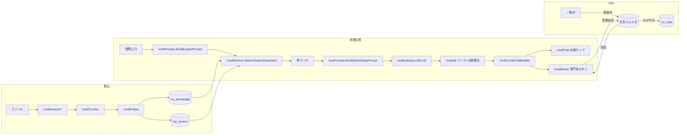

# Nexus Agent — アーキテクチャ設計書(現行版)

> このドキュメントは **現時点のコードベースを正**として書かれている。
> `docs/dev/MASTER_SPEC.md` は初期(3画面UI・V1)時代の実装契約書であり、
> §3(依存ルール)・§4(データモデル)・§6(エラーコード)・§12(コーディング規約)は
> 今も有効。§7(モジュール契約)以降の一部・§8(UI仕様)は「Nexus SPA化」以降
> 実態と乖離しているため、UI・機能に関する正はこの文書を参照すること。

## 1. プロダクトが何であるか

Excelブック(`.xlsm`)1個だけで動く、社内向けRAGチャットボット。配布は
ファイルコピーのみ(サーバー申請・IT部門依頼が不要)。起動すると
ネイティブExcel UIを隠し、Shape(図形)だけで組んだSPA風チャット画面
「Nexus Agent」が全画面表示される。

- バックエンド: VBA単体(外部サーバー無し)。LLM呼び出しは社内AIリボン
  (`ChatGPT()`/`GetEmbeddings()`)経由、または Azure OpenAI への直接HTTP
  (`embed_transport=direct`時のみ)。
- データストア: 同じブック内の非表示シート(`my_knowledge`/`my_vectors`等)。
  外部DBは無い。
- 協調(P2P): サーバー不要。共有ネットワークフォルダ配下にテキストファイルを
  1人1ファイルで置き合う「ファイルベースP2P」で、感謝状・専門家質問・
  ノイズ投票・チーム統計を実現する(§5)。

## 2. レイヤリングと依存ルール(R1〜R5)

```
src/
├── core/    … 基盤層。他のどの層からも参照される。configの読み書き、ログ、
│              LLM呼び出しゲートウェイ、共通ユーティリティ、状態退避。
├── ingest/  … 取込層。ファイル抽出→チャンク化→埋め込み→my_knowledge保存。
├── qa/      … QA層。検索(Float/バイナリ量子化ハイブリッド)→プロンプト
│              組み立て→LLM呼び出し→パース。
├── pack/    … パック層。エクスポート/インポート、PII検査、P2P(共有フォルダI/O)。
├── stats/   … 統計層。EXP/レベル/バッジ/ノイズ集計状態(my_stats)。
├── ui/      … UI層。Shape描画・イベントハンドラ・画面遷移。
├── opt/     … オプション機能層(Vision/Markdown/DiffDoc)。core経由(modFeatures)
│              でのみ他層から呼ばれる、取り外し可能な機能。
└── test/    … テストハーネス(3層。§6参照)。依存ルールの対象外。
```

**R1: 下位層から上位層を参照禁止。**
core ← ingest/qa/pack/stats ← ui という一方向のみ。ui層(Shape/Toast等)を
qa層やpack層のロジックから呼ぶことは禁止(`tools/vba_lint.py` が静的検査)。
違反例と是正: 狂気案Lv.1(`modBitwiseOpt`, qa層)は最初Toast表示をqa層から
直接呼んで lint に弾かれ、「qa層はUI非依存のログ文字列だけ保持→UI層
(`modApp`)が取り出してToast表示する」設計に是正した(実例はコミット
`f239497`参照)。

**R2〜R5**(§12「コーディング規約」に集約):
- R2: `Option Explicit` 必須、変数は使用前に`Dim`。
- R3: シート直接参照は基盤層(core)経由に集約(ハードコードしない)。
- R4: `src/test/` のPure Logicテスト対象モジュールは、LibreOffice実行環境で
  動くよう Excel専用オブジェクト(Worksheets/Range/Application等)への
  依存を最小化する(`tools/run_lo_tests.py` の `PURE_ALLOWLIST` 参照)。
- R5: エラーは握り潰さない。`modLog.LogError`/`FriendlyMessage` を通して
  必ず人間が読めるメッセージに変換する。

## 3. UIアーキテクチャ: Nexus SPA(Shape描画)

### 3.1 なぜShapeか
Excelのセル/数式バー/グリッド線を全て隠し(`modUI.InitUI`)、1枚のワーク
シート(`Nexus`)上にShape(図形)だけでチャットUIを組む。ボタンは
`Shape.OnAction`にVBAプロシージャ名を文字列で紐付ける(ハイパーリンク方式は
不採用＝R31実機でOnActionが死ぬため。R35以前は「自己インストーラ配布と両立しない」
という判断だったが、方式Bへ転換しても同理由で不採用のまま)。

### 3.2 画面構成
- サイドバー(`nx_sb_*`): ナビ(チャット/倉庫/ダッシュボード/再描画)、
  プロフィール、チーム連帯ウィジェット、質問テンプレチップ、ナレッジガチャ。
- トップバー(`nx_top_*`): 入力欄(セル`nx_input`という名前付き範囲)、送信、
  モード切替、言語切替、テーマ切替。
- フローティング・アクションバー(`nx_fab_*`): 選択中AIバブルへの操作
  (👍👎🔍✅📋📄)。バブル毎に個別ボタンを生成せず、画面上部に1セットだけ
  常設(Shape増殖による32bit Excelメモリクラッシュを防止する設計判断)。
- チャットバブル(`nx_msg_*`): ユーザー/AI発言。`MAX_BUBBLES`(40件)を
  超えると古い順に間引く(`CapBubbles`)。
- 出典チップ(`nx_cite_*`)・出典ポップアップ(`nx_peek`): Peek View(§4-6)。
- 専門家ボタン(`nx_mentor_*`)・返信ボタン: Mentor(§4-7)。
- ヘルプ(`nx_help_*`)・ツアー(`nx_tour_*`)・Toast(`nx_toast`)。

Shape命名は全て `nx_` 接頭辞+機能別サブ接頭辞で名前空間分離しており、
新機能追加時の衝突を防ぐ(例: `nx_sb_`=サイドバー系, `nx_fab_`=アクション
バー, `nx_help_`=ヘルプ)。

### 3.3 描画サイクルの不変条件(壊すと即クラッシュ級のバグになる)
新しい画面や機能を追加するときは、必ず以下を描画サイクルの最後に呼ぶ
(`modUI.InitUI`/`Repaint`、`modVault.ShowVaultGallery`等が実例):

1. `FreezeShapePlacement(ws)` — 全ShapeをxlFreeFloating(絶対配置)にし、
   セル(行高・列幅)追従によるズレを防ぐ。
2. `BringFixedToFront(ws)` — サイドバー/トップバー/アクションバーを
   最前面へ(Z-Order維持)。
3. `modSkin.BeautifyAll(ws)` — フォント統一+固定クロムへの柔らかい影。
4. `Application.ScreenUpdating = True` — 暗転(画面固まり)防止。
   例外パスも含め必ずTrueへ戻す(`modUiLock.Leave`が全アクションの出口で
   保証。詳細は§4-1)。

### 3.4 グローバルUIロック(`modUiLock`)
連打・多重発火(DoEventsの再入)を防ぐ単一の関所。全`OnAction`ハンドラは
先頭で`modUiLock.Enter()`を呼び、`False`なら即`Exit Sub`する。処理完了時は
必ず`modUiLock.Leave`を呼び、これが以下を保証する:

- 砂時計カーソル+ステータスバーの表示/解除。
- `Application.ScreenUpdating = True`の強制復帰(暗転ロックアウト対策)。
- フォーカスpark(`modUI.ParkFocus`): Shape選択解除+アクティブセルを
  安全な位置へ戻す(白い選択ハンドルの露出防止、矢印キーでのスクロール
  崩壊防止)。

## 4. 機能アーキテクチャ(疎結合プラグイン方式)

Nexus SPA化以降に追加した機能(Peek View以降)は、すべて**「新規モジュール
+ 呼び出し元への1行フック + モジュール内サーキットブレーカー」**という
統一パターンで実装している。これにより、新機能のバグが中核機能(RAG検索・
回答表示)へ波及することを構造的に防いでいる。

```vba
Public Sub 何らかのエントリポイント()
    On Error Resume Next   ' サーキットブレーカー: 全障害をここで握る
    ' ...機能本体...
    On Error GoTo 0
End Sub
```

呼び出し元(`modApp.LaunchNexus`/`OnSend`等)は、この1行を足すだけで良い:
```vba
modXxx.EntryPoint   ' 失敗しても「機能が動かないだけ」で他へ波及しない
```

この方式で実装された機能一覧は `docs/dev/FEATURES.md` を参照。

### 4.1 スキン(きせかえ)システム
配色解決を単一の実装(`modSkin.ResolveColor`)に集約し、`modUI.ThemeColor`
はそこへ委譲するだけの薄いラッパーになっている。全画面(Nexus/Vault/
Dashboard/Toast/チップ)が`modUI.UiColor(key)`経由で色を取得するため、
スキン追加は`modSkin.bas`内の色テーブル追加だけで全画面に反映される。

解放判定(称号=感謝受領数ベース)は**色を返す関数自身**(`ResolveColor`)の
中で強制しており、UI状態(`ui_state`シートの`nexus_theme`)を手動で
書き換えても、条件を満たさなければ描画結果はスタンダード配色に落ちる
(チート不可能な設計)。

## 5. P2P(ファイルベース協調)アーキテクチャ

サーバーもDBも使わず、共有ネットワークフォルダ上のテキストファイルだけで
複数ユーザー間の協調を実現する。設計原則は3つ:

1. **1人1ファイル書込み(または1(reporter, target)組で1ファイル)** —
   同時書込みの競合が原理的に起きない。
2. **collect-then-process** — `Dir()`で全対象ファイル名を配列へ集めてから
   処理する。列挙中に同じフォルダへ`Kill`すると`Dir()`の内部カーソルが
   壊れるため、削除は必ず2段階目で行う。
3. **リトライ+DoEvents待機** — アンチウイルスの一時ロック(実行時エラー70等)
   に対し、最大3回・250ms刻みの指数バックオフで再試行しつつ`DoEvents`で
   UIの応答性を保つ(`modP2P.WriteUtf8Retry`等)。

共有フォルダ配下のサブディレクトリ構成(`nexus_share_path`起点):

```
<nexus_share_path>/
├── thanks/     … 感謝状。ファイル名 thx_<宛先hash>_<送信者hash>-<時刻>-<連番>.txt
├── noise/      … ノイズ投票。noise_<対象hash>_<報告者hash>.txt(1報告者1票=上書き)
│              gexcl_<対象hash>.txt(組織的除外の確定フラグ。個別票を圧縮)
├── questions/  … Mentor質問。q_<宛先hash>_<送信者hash>-<時刻>-<連番>.txt
└── board/      … チーム連帯ビーコン。stats_<自分hash>.txt(1人1ファイル上書き)
```

ファイル名の識別子は全て `modUtil.Fnv1a64Hex`(16桁固定長ハッシュ)で
圧縮している。理由は2つ: (a) Windowsのファイル名禁止文字を含む生の
ユーザー名を使わない(サニタイズ漏れ対策)、(b) 深い共有フォルダパス
(部\課\チーム\...)配下でも合計パス長がMAX_PATH(260字)を超えない
(詳細は`docs/dev/EDGE_CASES.md` #P2P-3)。

## 6. RAG検索アーキテクチャ

### 6.1 標準経路(Float全件スキャン)
`modRetrieve.Search`/`SearchExpanded` が `my_vectors` 全件を読み込み、
質問ベクトルとの内積(コサイン類似度、全ベクトルL2正規化済み)でストリーミング
top-k選択(選択ソート、V2実証パターン踏襲)。ノイズ論理除外
(`modStats.ExcludedSources()`)を検索ループ内でスキップ判定として適用。

### 6.2 ハイブリッド経路(狂気案Lv.1・任意オプトイン)
`config binary_rag=TRUE` かつ件数が`binary_rag_min`(既定5000)以上のときのみ、
`modBitwiseOpt.Prefilter`が発火する:

1. 各ベクトルを符号ビット量子化(v≥0→1)してLong配列(32bit単位)へパック。
2. 質問ベクトルとのXOR+popcount(符号安全実装。§EDGE_CASESで検証詳細)で
   ハミング距離を計算し、上位`TOP_K_ROUGH`(既定200)件を高速に粗選別。
3. 粗選別された候補**行番号だけ**を`modRetrieve`へ返し、Float全件スキャンの
   ループに「候補外はスキップ」の1行ガードを追加(スコアリングロジック自体は
   無改変)。

既定`binary_rag=FALSE`のため、何も設定しなければ挙動は6.1のみで100%不変。

### 6.3 多段RAG(`retrieve_mode=multi`、既定)
クエリ拡張(`modAsk`→`modPrompts.BuildExpandPrompt`。独立質問化+サブクエリ+
HyDE仮回答)→マルチクエリ検索(`SearchExpanded`)→AIによる再ランク
(`BuildRerankPrompt`)→回答生成、の4段パイプライン。`retrieve_mode=single`で
単段(旧V1相当)に切替可能。

## 7. データフロー概要



## 8. ビルド・配布アーキテクチャ

- **R35（2026-09-03）で方式B へ転換**。`build/build_mybookshelf.py --dev|--prod`（既定`--vba-mode baked`）が
  `build/ovba_write.py` を呼んで完成品 `vbaProject.bin` を生成。155本モジュール
  +ThisWorkbook+Sheet1 を焼き込み、配布物は即座に動作する（実行時注入なし）。
- `--vba-mode installer`（開発用フォールバック）は1リリース限りの残置。方式A の
  自己インストーラ配布が必要なら使用。次ラウンドで削除予定。
- 新規`.bas`を追加したら必ず `build/modules.json` に登録すること
  (登録漏れはビルド段階で検出・エラーになる)。
- closed契約モジュール(`modStats`/`modAsk`/`modAppDef`/`modConfig`/
  `modUtil`等)へPublicメンバーを追加する場合は、`tools/vba_lint.py`の
  `CONTRACT`辞書も同時更新が必須(でないと lint が「契約違反」でエラーにする)。

## 9. 関連ドキュメント

| 目的 | ドキュメント |
|---|---|
| 機能の一覧・詳細説明 | `docs/dev/FEATURES.md` |
| データモデル/ER図 | `docs/dev/ER_DIAGRAM.md` |
| エッジケース・既知の罠カタログ | `docs/dev/EDGE_CASES.md` |
| 未対応・保留中の項目 | `docs/dev/TODO.md` |
| 拡張アイデア(採用/見送り) | `docs/dev/FUTURE_IDEAS.md` |
| 開発環境構築・PRの出し方 | `docs/dev/CONTRIBUTING.md` |
| 実装の時系列(コミット単位) | `docs/dev/CHANGELOG.md` |
| 初期(V1)実装契約書(歴史的資料) | `docs/dev/MASTER_SPEC.md` |
