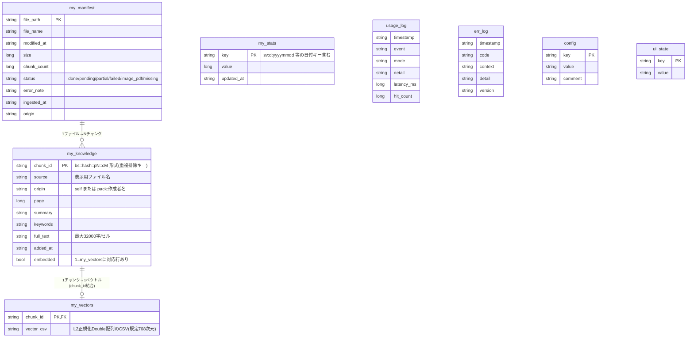
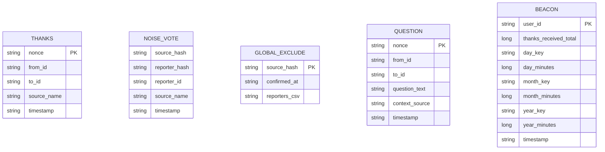

# Nexus Agent — データモデル / ER図

外部DBは無い。全データは同一ブック内の非表示シート(「表」として扱う)と、
共有ネットワークフォルダ上のテキストファイル(「疑似テーブル」)に格納する。

## 1. シート一覧(ブック内蔵の表)

| シート名 | 可視性 | 生成タイミング | 役割 |
|---|---|---|---|
| `はじめにお読みください` | visible(先頭・アクティブ) | ビルド時固定 | マクロ無効時の案内(軽量マクロガード)。起動成功時に非表示化 |
| `使い方` | visible | ビルド時固定 | 詳細マニュアル(ヘルプから遷移) |
| `ホーム` | visible | ビルド時固定 | 旧UI(V1)。`nexus_ui=TRUE`(既定)では実質未使用 |
| `マイ本棚` | visible | ビルド時固定 | 旧UI(V1)。同上 |
| `ダッシュボード` | visible | ビルド時固定 | 旧UI(V1)。同上 |
| `config` | hidden | ビルド時固定 | 設定キー台帳 |
| `my_knowledge` | veryHidden | ビルド時固定 | チャンク本体(RAGの実データ) |
| `my_vectors` | veryHidden | ビルド時固定 | 埋め込みベクトル |
| `my_manifest` | hidden | ビルド時固定 | 同期対象ファイルの取込台帳 |
| `my_stats` | hidden | ビルド時固定 | 統計カウンタ・EXP・バッジ・節約時間・称号元データ |
| `usage_log` | hidden | ビルド時固定 | 操作ログ(1行=1イベント) |
| `err_log` | hidden | ビルド時固定 | エラーログ |
| `ui_state` | veryHidden | ビルド時固定 | UI内部状態(モード・テーマ・会話復元・ツアー完了フラグ) |
| `vba_src` | veryHidden | ビルド時固定 | 自己インストーラ用ソース格納 |
| `Nexus` | visible | **実行時動的生成** | Nexus SPAのキャンバス(`modUI.GetOrCreateNexusSheet`) |
| `Dashboard` | visible | **実行時動的生成** | Nexus専用ダッシュボード(`modDash`) |

## 2. ER図(mermaid)

## 3. `my_knowledge` の詳細

- `chunk_id` 形式: `bs::<Fnv1a64Hex(full_text正規化後)>::p<page>::c<連番>`。
  ハッシュ部が内容ベースの重複排除キー(同一文章は再取込しても増えない)。
- `origin` は出典表示・専門家特定(Mentor)・感謝状の宛先解決の3機能すべての
  基点になる重要フィールド:
  - `self` → 「本棚に自分で入れた資料」。感謝状は送らない(自作には送らない)。
  - `pack:<作成者名>` → 出典表示は `[パック(作成者名):ファイル名]`。
    `modMentor.FindExpert`がこのフィールドから専門家を特定する。
- `embedded`(0/1)は取込の再開可能性を担保するフラグ。バッチ処理が
  中断しても、`embedded=0`の行だけを再走査すればよい。

## 4. `my_stats` のキー命名規則(汎用KVストアの読み解き方)

`my_stats`は単純な`key, value`の2列だが、キーの命名規則によって複数の
論理テーブルを1シートに畳み込んでいる:

| プレフィックス/パターン | 意味 | 書込元 |
|---|---|---|
| `ask_quick_total` / `ask_deep_total` / `ask_thorough_total` | 質問回数(モード別。合計は `modStats.AskTotalAll`) | `modAsk` |
| `selfsolve_total` / `hint_total` / `fail_total` | フィードバック集計 | `modAsk` |
| `thanks_received_total` | **感謝受領数(称号・スキン解放の唯一の源泉)** | `modP2P.CollectThanks` |
| `sv:d:yyyymmdd` / `sv:m:yyyymm` / `sv:y:yyyy` | 節約時間(日/月/年キー。**日付が変われば自動的に別キー=リセット不要**) | `modAsk.FeedbackGreen` |
| `wk:yyyyww` | 週次サマリー表示済みフラグ(ISO風年+週番号) | `modBoard` |
| `mq:<nonce>` | 受信済みMentor質問の重複排除済みフラグ | `modMentor` |
| `thx:<nonce>` | 受領済み感謝状の重複排除済みフラグ | `modP2P` |
| `fb:yyyymmdd` | ご意見箱EXPの1日1回ガード | `modHelp` |
| `noise:<source>` | 個人ミュート(自分の検索からのみ即時除外) | `modStats.ReportNoise` |
| `gexcl:<source>` | 組織的除外フラグ(閾値到達で全員の検索から除外) | `modStats.MarkGlobalExcluded` |
| `badge:<id>` | バッジ取得日 | `modStats.EvaluateBadges` |
| `streak_days` / `last_used_date` | 連続起動日数 | `modStats.TouchToday` |
| `exp_total` | 累計EXP(レベル計算の元) | `modStats.AddExp` |

**設計意図**: 日付/週番号をキーに含める方式(`sv:d:yyyymmdd`等)により、
「日次/月次/年次で自動リセットし、かつ過去分は消さず履歴として残る」を
追加ロジック無しで実現している(TouchTodayのようなリセット処理が不要)。

## 5. 共有フォルダ上の疑似テーブル(P2P)

シートではなくファイルだが、論理的には以下の「表」として扱われる。
詳細は `docs/dev/ARCHITECTURE.md` §5、ファイル名規則は §5の図を参照。

- `THANKS`: ファイル1件=感謝状1件。`to_id`は宛先ハッシュとしてファイル名に、
  `to_id`の生値はpayload(TSV)側に保持(照合用)。
- `NOISE_VOTE`: `(source_hash, reporter_hash)`の組で1ファイル。同じ人が
  同じ資料に再投票してもファイルが上書きされるだけ(票の水増し不可)。
- `GLOBAL_EXCLUDE`: 個別投票を集計後に生成される確定フラグ。`reporters_csv`
  に報告者一覧を圧縮保持し、個別投票ファイルはGCで削除される。
- `BEACON`: 1ユーザー1ファイル(上書き更新)。`modBoard`が起動の度に自分の
  最新値で上書きし、全員分を合算して組織全体の値を算出する。
