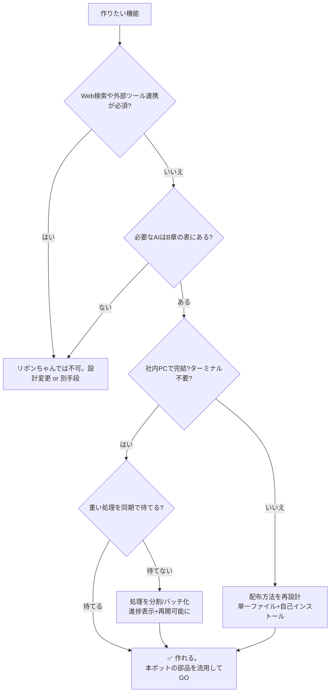

# リボンちゃんツール開発キット（次に活かすための資産）

> このプロジェクトで一番痛かったのは「リボンちゃんの仕様・社内制約を知らないまま着手して詰まった」こと。
> 二度と同じ所で止まらないための **着手前チェックリスト＋能力マトリクス＋判定フロー**。
> 新しいリボンちゃんツールを作るときは、**まずこの文書の質問票を埋めてから** Claude に渡す。

---

## A. 着手前インテーク質問票（これを埋めてから依頼する）

新しいツールを Claude に作らせる前に、以下を埋める。空欄が多いほどスタックする。
（前回スタックした最大の原因は「AI接続」「環境・制約」の欄が空だったこと。）

### A-1. やりたいこと
- [ ] 誰が使う？（部署・人数・PCは社内/社外）
- [ ] どんな業務の何を楽にする？（1文で）
- [ ] 入力は何？（テキスト/Excelの表/PDF貼付/画像/音声）
- [ ] 出力は何？（回答文/表/スライド/Word文書/画像）
- [ ] 成功の基準は？（例：本社照会が月◯件減る、◯分→◯分）

### A-2. AI接続（← 前回ここが空で詰まった）
- [ ] **リボンちゃんは対象PCに入っているか**（Excel/Word/PPTのどれに？）
- [ ] **使う機能はリボンちゃんの守備範囲か**（→ B章の能力マトリクスで確認）
- [ ] Web検索・外部ツール連携が要るか？（→ **リボンちゃんは不可**。要るなら設計から外す）
- [ ] 使うモデルは？（既定 GPT-5.5。軽くするなら gpt-5.4-nano 等）
- [ ] 1回の処理時間は許容範囲か（同期呼び出しでブロックする。重い処理は分割）

### A-3. 環境・制約（← ここも空だった）
- [ ] 社内PCでターミナルは使えるか？（**使えない前提**。配布は単一ファイル＋自己インストール）
- [ ] マクロは許可されているか／「VBAプロジェクトへのアクセスを信頼」はONか
- [ ] 社外（Mac等）で事前テストできるか？（できないなら mock モードを必ず用意）
- [ ] ネットワークは社内のみか（外部API直叩きは通らない前提）
- [ ] リボンちゃんの利用制限（`LimitCheck`/`IsAgreed`）に触れる頻度か

### A-4. データ
- [ ] ナレッジ/参照データはあるか？形式は？（PDF/Excel/貼付テキスト）
- [ ] 機密区分は？（個人情報・社外秘の有無）
- [ ] 更新頻度は？（誰がいつ差し替える？）
- [ ] 部署で見える範囲を分ける必要は？（dept_scope 設計）

### A-5. 配布・運用
- [ ] 配布手段は？（Teams/共有フォルダ/メール/USB。GitHubは社内から不可だった）
- [ ] 誰が管理者で、誰が更新するか
- [ ] フィードバック/精度改善の回し方（合格基準を**事前合意**する）

> **この質問票の埋まった状態を Claude に渡す＝ほぼ設計が終わっている。**

---

## B. リボンちゃん能力マトリクス（今あるモジュールでできること/できないこと）

`ver202606` の13モジュールを解析した結果。**接続先は Azure OpenAI（社内契約）**。

### ✅ できること（関数が存在）

| やりたいこと | 関数 | モジュール | 確度 |
|---|---|---|---|
| チャット補完（要約/分類/生成/QA） | `ChatGPT(...)` | GPT | ★確認済（本ボットで使用） |
| 文章のベクトル化（意味検索） | `GetEmbeddings(text)` | Embeddings | ★確認済（本ボットで使用） |
| 画像を理解する（Vision） | `ChatGPTV(text, imageInputs, ...)` | GPTV | △存在確認（要シグネチャ検証） |
| 画像を生成する | `Dalle(...)` / `GptImage(...)` / `StableImage(...)` | DALL | △存在確認 |
| 音声→文字（書き起こし） | `GetWhisper(filePath)` | Whisper | △存在確認 |
| 文字→音声（読み上げ） | `ttsFile(...)` / `ttsSpeak(...)` | Tts | △存在確認 |
| 翻訳（セル/図形/グラフ/SmartArt） | `Translate(text, lang)` / `TranslateS(...)` | AI2 | △存在確認 |
| Markdownをセル/Wordに整形描画 | `CellMarkDown(rng)` / `OpenWordMark(text)` | ExcelTool/Tool | △存在確認 |
| Excel範囲を表テキスト化 | `RangeToTable(rng)` | AI | △存在確認 |
| モデル一覧/選択 | `GetGPTModelList` / `SetGPTmodel` | GPT | △存在確認 |

> ★＝本プロジェクトで実呼び出し済み。△＝モジュール内に関数は実在するが、`Application.Run` 経由の
> 呼び出し可否・引数仕様は未検証。**使う前に1関数1回のスモークテストで確認すること。**

### ❌ できないこと（設計から外す）

| 無理なこと | 理由 |
|---|---|
| Web検索・最新情報の取得 | `web_search`/`tools` ペイロードが一切ない。`toolN` はログ名だけ |
| 外部ツール/関数呼び出し（function calling） | 同上。ツール連携の口がない |
| ストリーミング応答（逐次表示） | 同期 XMLHTTP（`.Open ... False`）。完了まで待つ |
| 外部APIを直接叩く | 社内ネットワーク/プロキシで通らない（V1の死因） |
| 自前APIキーでの独自接続 | 持つと秘匿・承認で詰む。**リボン相乗りが正解** |
| 無制限の大量呼び出し | `LimitCheck`/`IsAgreed` の利用制限・同意ゲートがある |

---

## C. 最小実装に必要なもの（チェックリスト）

新ツールを動かす最小セット：
- [ ] 本物のExcel製スケルトン `.xlsm`（`build/template_skeleton.xlsm` を流用）
- [ ] 自己インストーラ方式のビルドスクリプト（`build/build_chatbot_v2.py` を雛形に）
- [ ] AI呼び出しの**窓口モジュール**（`modEmbeddings`/`modRibbonGateway` を流用：失敗を握りつぶす防御をここに集約）
- [ ] `config` シート（挙動をコード変更なしで切替）
- [ ] `mock` モード（リボン無しでMacで通すため）
- [ ] 参照データを載せるシート（必要なら）

---

## D. 「これはリボンちゃんで作れる？」判定フロー

---

## E. 詰まりやすい既知の制約（先回りで知っておく）

1. **配布バイナリは手作りNG** → 本物Excel製スケルトン＋2ストリーム差し替え（自己インストーラ）。
2. **初回オープンで自動起動しない罠** → インストーラ末尾で `Application.Run "modBoot.Boot"` を呼ぶ。
3. **「VBAプロジェクトへのアクセスを信頼」がOFFだとインストール不可** → 利用者環境の前提を確認。
4. **同期呼び出しでExcelが固まる** → `DoEvents`＋進捗バー＋ESC中断＋再開可能、で体感を守る。
5. **Macで事前テスト不可な機能がある** → mock モード必須。本番前に必ず実機1回スモークテスト。
6. **利用制限/同意ゲート** → 大量バッチ（ベクトル化等）は再開可能設計にする。
