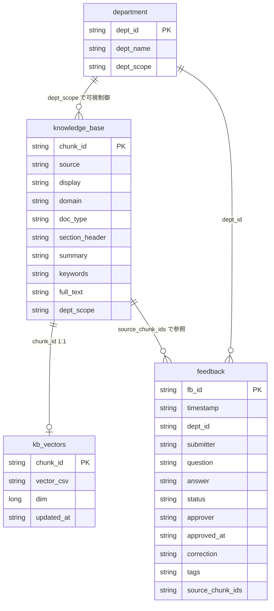
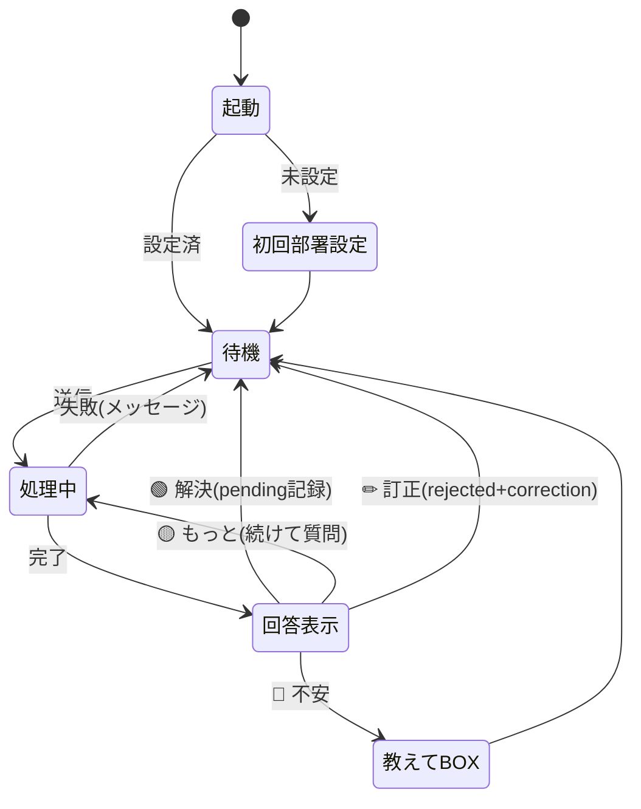
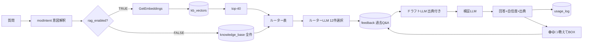
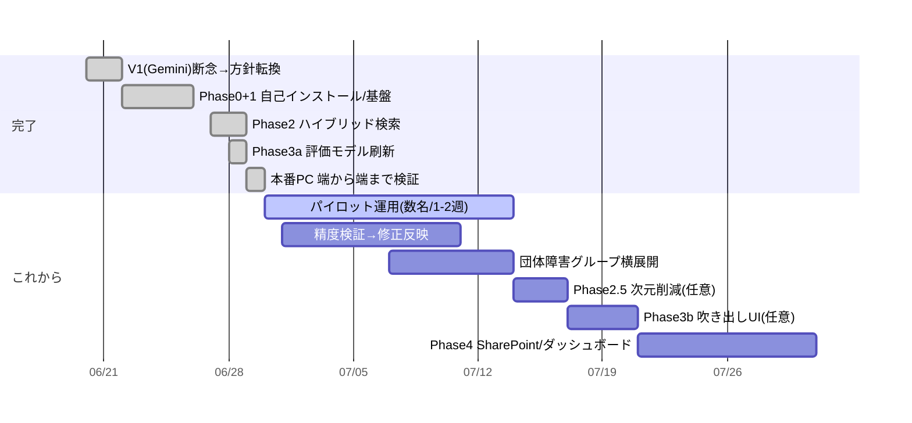

# 設計仕様書（要件定義・データモデル・画面・エッジケース・セキュリティ）

> Web系の定番ドキュメント（API設計・ER図・画面遷移など）を、**Excel/VBA＋リボン**という
> 本プロダクトの形態に翻訳して1冊にまとめたもの。GitHub上で図（mermaid）はそのまま描画される。

---

## 1. プロダクト概要

- **名称**：社内ナレッジQAチャットボット V2
- **利用者**：新種保険部・営業担当者（社内PC）
- **課題**：保険商品の照会のたびに本社へ問い合わせ、往復で時間がかかる。営業の理解も深まりにくい。
- **解決**：約款・ガイドラインを出典つきで自動回答。自己解決を促し、本社負荷を下げる。
- **形態**：Excel単体（.xlsm）。社内AIリボン相乗り。新規APIキー・外部依存なし。

---

## 2. 機能要件

| ID | 機能 | 概要 |
|---|---|---|
| F-01 | 質問応答 | 質問を入力 → 出典つき構造化回答 |
| F-02 | 意図解釈 | 真意・前提を抽出し検索を精緻化（smart/always切替） |
| F-03 | ハイブリッド検索 | 埋め込みで候補40件→ルーターLLMが12件精選（rag_enabledで切替） |
| F-04 | 自己検証 | 根拠なき断定を削除/修正（verifier_enabledで切替） |
| F-05 | 自信度表示 | 🟢🟡🔴 で根拠の確からしさを提示 |
| F-06 | 反応収集 | 🟢解決/🟡もっと/🔴不安 を記録、次の行動へ誘導 |
| F-07 | 教えてBOX | 本社照会パケット（論点整理済）を自動生成 |
| F-08 | 自己学習 | feedbackに蓄積、承認済み過去Q&Aを再利用 |
| F-09 | 部署別ナレッジ | dept_scopeで可視範囲を制御 |
| F-10 | 管理者ベクトル化 | 全件ベクトル化（再開可能・耐障害） |
| F-11 | 出力 | テキスト/HTML出力 |
| F-12 | 自己診断 | 接続・構成のチェック |

---

## 3. 非機能要件

| 区分 | 要件 |
|---|---|
| 可用性 | AI呼び出し失敗時も**質問は止めない**（全件フォールバック等） |
| 性能 | 1問 数十秒（精度優先）。configで軽量化可 |
| 配布性 | 単一.xlsm・自己インストール。情シス作業・アドイン登録不要 |
| 保守性 | 挙動はconfig/シートで変更（コード変更を最小化） |
| 移植性 | ナレッジ入れ替えで横展開（コード不変） |
| 安全性 | 自前APIキーを持たない。個人情報の簡易検知（modPii） |
| 可観測性 | usage_log・debug_mode・自己診断 |
| 運用容易性 | 非エンジニアが管理者作業できる（ボタン操作） |

---

## 4. 技術スタック

| 層 | 採用 |
|---|---|
| 実行基盤 | Microsoft Excel（Windows社内PC） |
| ロジック | VBA（18モジュール） |
| AI接続 | 社内AIリボン「リボンちゃん」経由 Azure OpenAI |
| チャット | GPT-5.5（config可換） |
| 埋め込み | text-embedding-3-small（1536次元・L2正規化） |
| データ保持 | Excelシート（knowledge_base / kb_vectors / feedback 等） |
| ビルド | Python（openpyxl, olefile）＋自己インストーラ方式 |
| 前処理 | Python（pypdf/pdfplumber, Gemini-2.5-flashで富化） |

---

## 5. データモデル（シート＝テーブル）／ER相当



補助シート：`config`（key/value/comment）、`system_prompt`、`manifest`、`usage_log`、`vba_src`、`admin`。

---

## 6. 「API設計」＝呼び出しコントラクト

本プロダクトに外部REST APIはない。「API」に相当するのは2系統の契約：

### 6-1. 外部契約（リボンちゃん）
```
Application.Run("ChatGPT", text, roleSystem, Temperature, MaxTokens, Wait,
                optModel, prevU, prevA, toolN, reasoning_effort, verbosity) -> String
Application.Run("GetEmbeddings", text) -> "v1,v2,...,v1536"  | "error"
```
詳細・制約は `30_リボンちゃん仕様.md`。

### 6-2. 内部契約（主要モジュールI/F）
```
modPipeline.RunQuery(question)                         ' 全体制御の入口
modRetrieve.BuildRouterTableHybrid(qText, deptId)      ' 検索ゲートウェイ（rag_enabledで分岐）
modEmbeddings.EmbedText(text) -> csv | ""              ' 失敗は "" を返す（例外を投げない）
modEmbeddings.CosineSim(a(), b()) -> Double
modKnowledgeBase.BuildRouterTable(deptId)              ' 全件表（フォールバック）
modKnowledgeBase.BuildRouterTableFromIds(idsCsv, deptId)
modFeedbackLookup.FindSimilarApproved(q, deptId, user) ' 過去Q&A
```
**設計規約**：AI呼び出しは窓口モジュールに集約し、失敗は `""` 等の安全値に変換して上位はフォールバックする。

---

## 7. 画面構成（ワイヤーフレーム）と画面遷移

### 7-1. main シート ワイヤーフレーム
```
┌──────────────────────────────────────────────┐
│ 社内ナレッジ QA ボット (v2 - 社内AIリボン)         │  タイトル
│ 部署: 費用利益保険チーム                          │
├──────────────────────────────────────────────┤
│ [ ここに質問を書いてください ............... ] [送信] │  入力
├──────────────────────────────────────────────┤
│ 🟢/🟡/🔴 自信度バナー                            │
│ 回答本文（【根拠】[#1][#2] / 【解釈・当てはめ】）    │  出力
│ 出典一覧                                        │
├──────────────────────────────────────────────┤
│ [🟢 スッキリ解決][🟡 もう少し知りたい][🔴 まだ不安] │  反応
│ [📮 教えてBOX][✏ 正しい答え][テキスト出力][HTML出力]│
│ [自己診断][リボン接続テスト][再起動]               │
└──────────────────────────────────────────────┘
（admin シートは hidden：①接続テスト ②全件ベクトル化）
```

### 7-2. 画面遷移図


---

## 8. データフロー



---

## 9. エッジケース定義と対応（実装済みの防御）

| # | エッジケース | 対応 |
|---|---|---|
| E-01 | 埋め込みが "error"/空を返す | `EmbedText` が "" を返し、全件ルーターへフォールバック |
| E-02 | ベクトル候補が0件 | 全件表にフォールバック |
| E-03 | ベクトル文字列が壊れている | `ParseVector` がFalse→その行をスキップ |
| E-04 | k > 件数 | 可視全件を返す（降順ソート維持） |
| E-05 | 可視チャンクが0件 | "" を返し全件へ |
| E-06 | ベクトル化が途中で中断 | 既存分を保存、再押下で続きから再開（doneIdsで判定） |
| E-07 | 1チャンクの埋め込み失敗 | 記録してスキップ、全体は止めない／再試行で回収 |
| E-08 | 初回オープンで自動起動しない | インストーラ末尾で `modBoot.Boot` を明示実行 |
| E-09 | 保存失敗（読み取り専用/ロック） | 握りつぶして処理継続 |
| E-10 | 意図解釈が失敗 | そのStepを飛ばして続行（graceful degradation） |
| E-11 | knowledge_base が空 | 起動時にメッセージ、gReady=False |
| E-12 | 個人情報を含む質問 | modPii で簡易検知 |
| E-13 | 開発者クレジット質問 | 約款と無関係なので最初に横取りして回答 |
| E-14 | mock_llm=TRUE のまま配布 | 配布前チェック項目（手順書に明記） |
| E-15 | scrrun.dll 等が社内で制限 | Dictionary不使用の純VBA実装（feedback類似はbigram） |

---

## 10. セキュリティ設計

- **秘密情報を持たない**：APIキーはリボン側。本ボットの成果物にキー無し（git/配布物の漏洩経路を断つ）。
- **接続先**：社内AIリボン経由の Azure OpenAI（社内契約）のみ。外部API直叩きなし。
- **データ局所性**：ナレッジ・ベクトル・feedbackは全てファイル内シート。外部送信は質問テキストのAI処理のみ。
- **可視範囲制御**：dept_scopeで部署外ナレッジの混在を防ぐ（検索の最初の段で適用）。
- **個人情報**：modPiiで簡易検知。`kb_vectors`はveryHidden。
- **申し送り（情シス）**：リボン側のAPIキーがハードコード。ローテーション＋環境変数化を推奨（`30_`参照）。
- **配布**：自己インストールは「VBAプロジェクトへのアクセスを信頼」前提。信頼境界を理解した上で配布。

---

## 11. 工程表（実績と予定）



> 日付は目安。実績は `50_ロードマップ.md` を正とする。
